# RAO — Instrukcja obsługi aplikacji

> **Wersja:** 1.0 | **Data:** 2026-07-11
> **Aplikacja:** RAO — system zarządzania wynajmem maszyn budowlanych
> **Dostęp:** Otwórz przeglądarkę i wpisz adres aplikacji. Jeden użytkownik, pełny dostęp do wszystkiego po zalogowaniu.

---

## Spis treści

1. [Logowanie](#1-logowanie)
2. [Odzyskiwanie hasła](#2-odzyskiwanie-hasła)
3. [Zmiana hasła](#3-zmiana-hasła)
4. [Ekran główny — pulpit startowy](#4-ekran-główny--pulpit-startowy)
5. [Lista umów](#5-lista-umów)
6. [Lista kontrahentów](#6-lista-kontrahentów)
7. [Lista maszyn i artykułów](#7-lista-maszyn-i-artykułów)
8. [Formularz kontrahenta](#8-formularz-kontrahenta)
9. [Formularz maszyny/artukułu](#9-formularz-maszynyartykułu)
10. [Rezerwacje maszyn](#10-rezerwacje-maszyn)
11. [Umowy — tworzenie i edycja](#11-umowy--tworzenie-i-edycja)
12. [Pulpit pracownika](#12-pulpit-pracownika)
13. [Prowizje](#13-prowizje)
14. [Ustawienia](#14-ustawienia)
15. [Administracja użytkownikami](#15-administracja-użytkownikami)
16. [Archiwum](#16-archiwum)
17. [Analityka i statystyki](#17-analityka-i-statystyki)
18. [FAQ — najczęstsze problemy](#18-faq--najczęstsze-problemy)

---

## 1. Logowanie

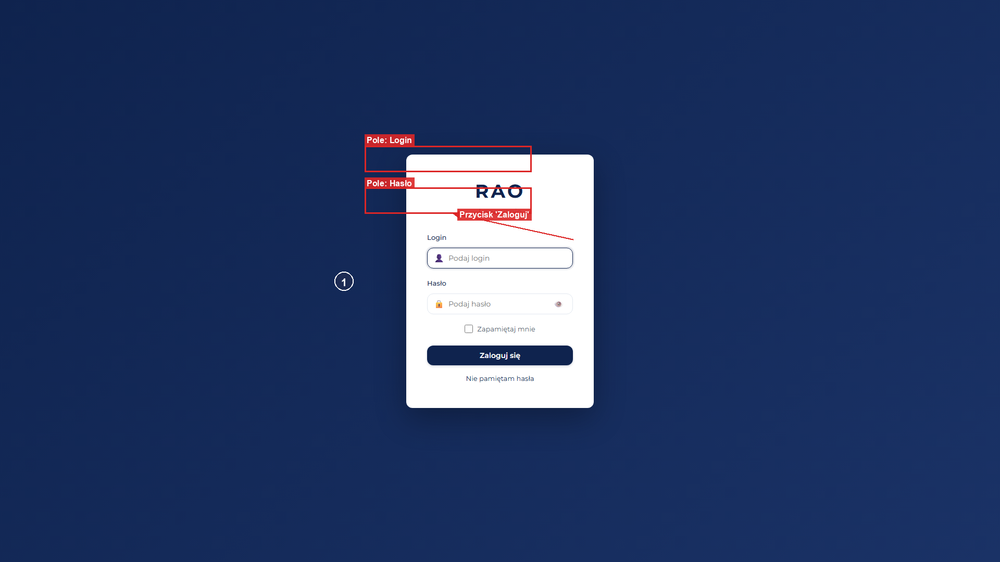

### Jak się tam dostać

- Wpisz w pasek adresu przeglądarki adres aplikacji (z dopiskiem `/login` na końcu).
- Ten ekran pojawi się automatycznie, gdy spróbujesz wejść do aplikacji bez wcześniejszego zalogowania — niezależnie od tego, który adres wpiszesz, zostaniesz tu przeniesiony.
- Po wylogowaniu również trafisz tutaj.

### Co widzisz po wejściu

Cały ekran ma ciemnogranatowe, gradientowe tło. Na samym środku znajduje się biała, zaokrąglona karta. Od góry karty widać:
- Duże logo **RAO** (granatowe litery, wyśrodkowane).
- Pod nim mniejszy, szary nagłówek **Logowanie**.
- Poniżej formularz z polami.
- Na samym dole karty link „Nie pamiętam hasła".

### Pola formularza

**1. Login**
- Etykieta nad polem: „Login".
- Po lewej stronie wewnątrz pola widoczna mała ikonka ludzika.
- Co wpisać: swój login nadany przez administratora (np. `admin`).
- Pole wymagane — bez wpisania nie przejdziesz dalej.
- W polu widoczny jest jasny podpowiedziowy tekst „Podaj login", który znika, gdy zaczniesz pisać.

**2. Hasło**
- Etykieta nad polem: „Hasło".
- Po lewej stronie wewnątrz pola widoczna mała ikonka kłódki.
- Co wpisać: swoje hasło do aplikacji. Znaki są ukryte (widoczne jako kropki).
- Pole wymagane.
- Po prawej stronie wewnątrz pola znajduje się mały przycisk z ikonką oka — służy do pokazania/ukrycia wpisanego hasła.

**3. Zapamiętaj mnie** (pole wyboru — kwadracik)
- Etykieta: „Zapamiętaj mnie" obok małego kwadracika.
- Kliknij kwadracik, aby zaznaczyć (pojawi się ptaszek), jeśli chcesz, aby aplikacja pamiętała Twoją sesję.
- Pole opcjonalne — nie jest wymagane. Domyślnie odznaczone.

### Przyciski

**Przycisk „Zaloguj się"** (granatowy, duży, na całą szerokość karty)
- Po kliknięciu przycisk zostaje zablokowany, a wewnątrz pojawia się obracająca się ikonka ładowania.
- Aplikacja sprawdza Twój login i hasło.
- Jeśli dane są poprawne — zostajesz przeniesiony na ekran główny.
- Jeśli dane są poprawne, ale system wymaga zmiany hasła (np. pierwsze logowanie) — zostajesz przeniesiony na ekran zmiany hasła.
- Jeśli dane są błędne — przycisk wraca do stanu normalnego, a karta formularza „potrząsa" na boki i pojawia się czerwony komunikat błędu.

**Przycisk oka wewnątrz pola „Hasło"**
- Kliknięcie: wpisane hasło zmienia się z kropek na widoczne znaki (i odwrotnie). Przydatne, gdy chcesz sprawdzić, czy nie zrobiłeś literówki.

**Link „Nie pamiętam hasła"** (pod przyciskiem „Zaloguj się")
- Po kliknięciu pojawia się okienko „Reset hasła" z polem na adres e-mail.
- Wpisz swój adres e-mail i kliknij „Wyślij link" — system wyśle na ten adres wiadomość z linkiem do ustawienia nowego hasła.
- Pojawi się zielony komunikat: „Link do resetu hasła został wysłany."
- Kliknięcie w ciemne tło poza oknem zamyka okno.

### Workflow — standardowe logowanie

1. Otwórz aplikację. Zobaczysz ekran logowania z białą kartą na środku.
2. Wpisz swój login w polu „Login" (np. `admin`).
3. Wpisz swoje hasło w polu „Hasło" (np. `admin123`). Znaki pojawią się jako kropki.
4. (Opcjonalnie) Zaznacz „Zapamiętaj mnie", jeśli nie chcesz logować się za każdym razem.
5. Kliknij granatowy przycisk „Zaloguj się". Przycisk pokaże obracającą się ikonkę.
6. Po krótkiej chwili zostaniesz przeniesiony na ekran główny.

### Workflow — odzyskiwanie zapomnianego hasła

1. Na ekranie logowania kliknij link „Nie pamiętam hasła".
2. Pojawi się okienko „Reset hasła". Wpisz swój adres e-mail (np. `jan.kowalski@firma.pl`).
3. Kliknij „Wyślij link". Przycisk zmieni się na „...".
4. Pojawi się zielony komunikat „Link do resetu hasła został wysłany."
5. Otwórz swoją skrzynkę e-mail. Znajdź wiadomość od systemu RAO z linkiem.
6. Kliknij link w mailu. Zostaniesz przeniesiony do ekranu ustawiania nowego hasła (patrz rozdział 2).
7. Wpisz nowe hasło dwa razy i potwierdź. Po ustawieniu hasła zostaniesz przekierowany z powrotem na ekran logowania.

### Komunikaty

- **Sukces (logowanie):** brak komunikatu tekstowego — następuje płynne przejście do ekranu głównego.
- **Sukces (reset hasła):** „Link do resetu hasła został wysłany." — sprawdź skrzynkę e-mail (również folder Spam).
- **Błąd (logowanie):** Czerwony pasek z ikonką i tekstem błędu (np. „Nieprawidłowy login lub hasło"). Co zrobić: sprawdź literówki, czy Caps Lock nie jest wciśnięty, spróbuj ponownie.
- **Błąd (reset hasła):** „Błąd. Sprawdź adres email." Co zrobić: upewnij się, że wpisany adres jest poprawny.

### Stany ekranu

- **Ładowanie:** Po kliknięciu „Zaloguj się" przycisk zostaje zablokowany, a w jego środku pojawia się obracająca się ikonka zamiast napisu. Nie klikaj ponownie — poczekaj chwilę.
- **Błąd:** Przy błędnych danych pola otrzymują czerwoną obwódkę, a pod polami pojawia się czerwony pasek z opisem błędu. Cała karta formularza krótko „potrząsa" na boki.

### Skróty klawiszowe

- **Tab** — przenosi kursor kolejno między polami (Login → Hasło → Zapamiętaj mnie → Zaloguj się).
- **Enter** — działa jak kliknięcie przycisku „Zaloguj się".
- Pole „Login" jest aktywne od razu po wejściu na ekran — możesz od razu zacząć pisać.

---

## 2. Odzyskiwanie hasła

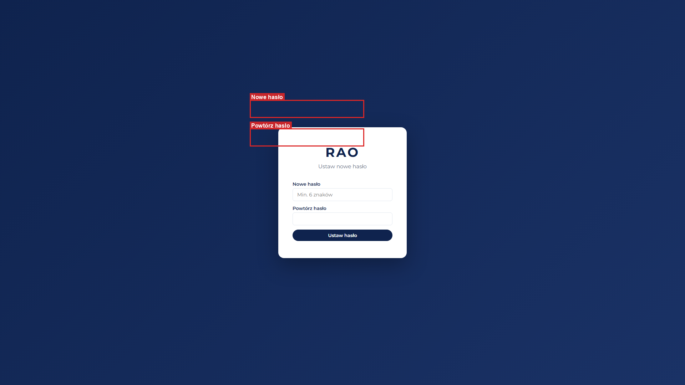

### Jak się tam dostać

- Wyłącznie przez kliknięcie linku w wiadomości e-mail, którą system wysyła po wypełnieniu okienka „Nie pamiętam hasła" na ekranie logowania.
- Wpisanie ręcznie adresu bez poprawnego kodu z maila nie zadziała.

### Co widzisz po wejściu

Cały ekran ma ciemnogranatowe, gradientowe tło (podobnie jak ekran logowania). Na środku znajduje się biała, zaokrąglona karta. Od góry:
- Logo **RAO**.
- Nagłówek **„Ustaw nowe hasło"**.
- Poniżej formularz z dwoma polami.
- Na dole karty granatowy przycisk na całą szerokość.

### Pola formularza

**1. Nowe hasło**
- Etykieta nad polem: „Nowe hasło".
- Co wpisać: nowe hasło, które chcesz ustawić od teraz. Musi mieć minimum 6 znaków.
- Pole wymagane.
- Znaki są ukryte (kropki).

**2. Powtórz hasło**
- Etykieta nad polem: „Powtórz hasło".
- Co wpisać: dokładnie to samo hasło, co w polu wyżej — dla potwierdzenia, że nie zrobiłeś literówki.
- Pole wymagane.
- Znaki ukryte (kropki).

### Przyciski

**Przycisk „Ustaw hasło"** (granatowy, na całą szerokość karty)
- Po kliknięciu przycisk zostaje zablokowany i zmienia tekst na „...".
- Aplikacja sprawdza, czy oba hasła są takie same i czy spełniają wymagania (min. 6 znaków).
- Jeśli wszystko poprawne — hasło zostaje zapisane, a pod przyciskiem pojawia się zielony komunikat **„Hasło ustawione. Przekierowanie..."**.
- Po około 2 sekundach zostajesz automatycznie przeniesiony na ekran logowania.
- Jeśli wystąpi błąd — przycisk wraca do normalnego stanu i pojawia się czerwony komunikat.

### Workflow — krok po kroku

1. Otwórz maila od systemu RAO i kliknij w nim link. Otworzy się ekran „Ustaw nowe hasło".
2. W polu „Nowe hasło" wpisz nowe hasło (minimum 6 znaków). Znaki pojawią się jako kropki.
3. W polu „Powtórz hasło" wpisz dokładnie to samo hasło.
4. Kliknij przycisk „Ustaw hasło". Przycisk zmieni się na „...".
5. Pojawi się zielony komunikat „Hasło ustawione. Przekierowanie...".
6. Po około 2 sekundach zostaniesz przeniesiony na ekran logowania.
7. Zaloguj się, wpisując swój login i nowe hasło.

### Komunikaty

- **Sukces:** „Hasło ustawione. Przekierowanie..." — poczekaj 2 sekundy, nastąpi przejście do ekranu logowania.
- **Błąd — hasła różnią się:** Czerwony komunikat. Co zrobić: wpisz oba hasła ponownie, upewniając się, że są identyczne.
- **Błąd — hasło za krótkie:** Czerwony komunikat o wymaganej długości. Co zrobić: wpisz hasło składające się z minimum 6 znaków.
- **Błąd — link wygasł lub jest nieprawidłowy:** Czerwony komunikat. Co zrobić: wróć do ekranu logowania, kliknij „Nie pamiętam hasła" i wyślij sobie nowy link.

### Ważne

- Link z maila jest jednorazowy — po użyciu nie zadziała ponownie. Jeśli potrzebujesz resetu jeszcze raz, wyślij nowy link z ekranu logowania.

---

## 3. Zmiana hasła

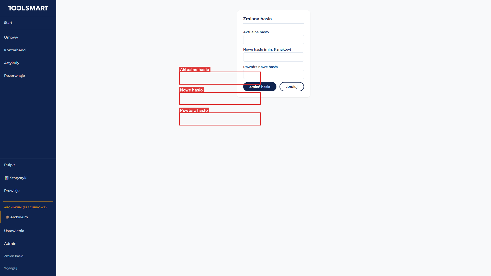

### Jak się tam dostać

- Po zalogowaniu — z menu aplikacji wybierz opcję zmiany hasła (w menu użytkownika, w prawym górnym rogu).
- Automatycznie — po pierwszym logowaniu, jeśli system wymusza zmianę hasła. Zostaniesz tu przeniesiony bezpośrednio po wpisaniu hasła na ekranie logowania.

### Co widzisz po wejściu

Na środku ekranu (na jasnym tle aplikacji) znajduje się biała karta z lekkim cieniem. Od góry:
- Nagłówek **„Zmiana hasła"** (granatowy).
- Poniżej formularz z trzema polami.
- Na dole dwa przyciski obok siebie: „Zmień hasło" (granatowy) i „Anuluj" (szary).

### Pola formularza

**1. Aktualne hasło**
- Etykieta nad polem: „Aktualne hasło".
- Co wpisać: hasło, którego używasz obecnie.
- Pole wymagane. Znaki ukryte (kropki).

**2. Nowe hasło (min. 6 znaków)**
- Etykieta nad polem: „Nowe hasło (min. 6 znaków)".
- Co wpisać: nowe hasło. Musi mieć minimum 6 znaków.
- Pole wymagane. Znaki ukryte (kropki).

**3. Powtórz nowe hasło**
- Etykieta nad polem: „Powtórz nowe hasło".
- Co wpisać: dokładnie to samo nowe hasło, co w polu wyżej.
- Pole wymagane. Znaki ukryte (kropki).

### Przyciski

**Przycisk „Zmień hasło"** (granatowy, po lewej)
- Po kliknięciu przycisk zmienia tekst na „Zapisywanie..." i zostaje zablokowany.
- Aplikacja sprawdza: czy aktualne hasło jest poprawne, czy nowe hasło ma min. 6 znaków, czy oba nowe hasła są identyczne, czy nowe hasło różni się od aktualnego.
- Jeśli wszystko poprawne — hasło zostaje zmienione, pojawia się zielony komunikat **„Hasło zmienione pomyślnie. Przekierowanie..."**.
- Po około 1,5 sekundy zostajesz przeniesiony na ekran główny.

**Przycisk „Anuluj"** (szary, po prawej)
- Natychmiast zostajesz przeniesiony na ekran główny bez zapisywania zmian.

### Workflow — dobrowolna zmiana hasła

1. Zaloguj się do aplikacji i z menu wybierz opcję zmiany hasła.
2. W polu „Aktualne hasło" wpisz hasło, którego używasz teraz.
3. W polu „Nowe hasło (min. 6 znaków)" wpisz nowe hasło (minimum 6 znaków).
4. W polu „Powtórz nowe hasło" wpisz dokładnie to samo nowe hasło.
5. Kliknij „Zmień hasło". Przycisk zmieni się na „Zapisywanie...".
6. Pojawi się zielony komunikat „Hasło zmienione pomyślnie. Przekierowanie...".
7. Po około 1,5 sekundy zostaniesz przeniesiony na ekran główny. Od teraz loguj się nowym hasłem.

### Komunikaty

- **Sukces:** „Hasło zmienione pomyślnie. Przekierowanie..."
- **Błąd — błędne aktualne hasło:** Czerwony komunikat. Co zrobić: wpisz poprawne aktualne hasło ponownie.
- **Błąd — hasła różnią się:** Czerwony komunikat. Co zrobić: wpisz oba nowe hasła ponownie.
- **Błąd — hasło za krótkie:** Czerwony komunikat. Co zrobić: wpisz hasło z minimum 6 znakami.

---

## 4. Ekran główny — pulpit startowy

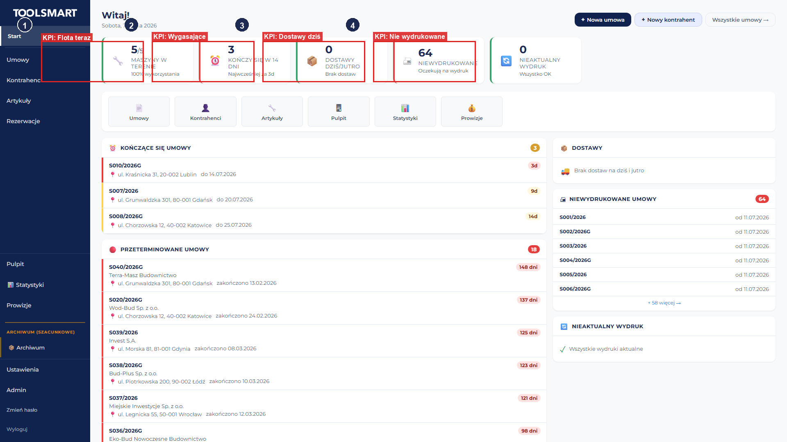

### Jak się tam dostać

- Po poprawnym zalogowaniu — zostaniesz tu przeniesiony automatycznie.
- Kliknij logo RAO lub pozycję „Pulpit" w menu bocznym aplikacji (jeśli jesteś na innym ekranie).

### Co widzisz po wejściu

Ekran jest podzielony na kilka poziomych pasów od góry do dołu:

**1. Górny pas — powitanie i szybkie akcje:**
- Po lewej stronie duży nagłówek z powitaniem zależnym od pory dnia:
  - Rano (przed 12:00): **„Dzień dobry!"**
  - Po południu (12:00–18:00): **„Witaj!"**
  - Wieczorem (po 18:00): **„Dobry wieczór!"**
- Pod powitaniem widoczna jest dzisiejsza data zapisana po polsku, np. „poniedziałek, 15 stycznia 2024".
- Po prawej stronie trzy przyciski szybkich akcji: „+ Nowa umowa", „+ Nowy kontrahent", „Wszystkie umowy →".

**2. Drugi pas — pasek wskaźników (KPI):** Pięć kolorowych kafelek obok siebie, każdy z ikonką, dużą liczbą i opisem. Kolory kafelek zmieniają się w zależności od sytuacji (zielony = dobrze, żółty = uwaga, czerwony = pilne).

**3. Trzeci pas — pasek szybkiej nawigacji:** Sześć kafelków z ikonkami i etykietami: Umowy, Kontrahenci, Artykuły, Pulpit, Statystyki, Prowizje. Kliknięcie przenosi do odpowiedniego działu.

**4. Czwarty pas — główna siatka zawartości (dwie kolumny):**
- **Lewa kolumna:** Dwa panele:
  - Panel „Kończące się umowy" (ikona ⏰) — lista umów, które kończą się w ciągu 14 dni.
  - Panel „Przeterminowane umowy" (ikona 🔴) — lista umów, których termin już minął.
- **Prawa kolumna:** Trzy panele:
  - Panel „Dostawy" (ikona 📦) — dostawy zaplanowane na dziś i jutro.
  - Panel „Niewydrukowane umowy" (ikona 🖨) — umowy, które nie zostały jeszcze wydrukowane.
  - Panel „Nieaktualny wydruk" (ikona 🔄) — umowy, które były wydrukowane, ale potem uległy zmianie i wymagają ponownego wydruku.

Po lewej stronie ekranu znajduje się menu boczne aplikacji z nawigacją do wszystkich działów.

### Kafelki wskaźników (KPI)

Kafelki są informacyjne (pokazują liczby), ale nie są klikalne — służą do szybkiego podglądu sytuacji.

**1. „Maszyny w terenie"** (ikona 🔧)
- Pokazuje liczbę w formacie „X/Y" — np. „12/30" oznacza: 12 maszyn wynajętych na 30 ogółem.
- Pod liczbą napis „Maszyny w terenie" oraz „X% wykorzystania".
- Kolor: zielony (≥70% wykorzystania), żółty (40–70%), niebieski (<40%).

**2. „Kończy się w 14 dni"** (ikona ⏰)
- Pokazuje liczbę umów, które kończą się w ciągu najbliższych 14 dni.
- Kolor: zielony (0 umów), żółty (1–2 umowy), czerwony (3 i więcej — sytuacja pilna).

**3. „Dostawy dziś/jutro"** (ikona 📦)
- Pokazuje liczbę dostaw zaplanowanych na dziś i jutro.
- Kolor: zielony (brak dostaw), niebieski (są dostawy).

**4. „Niewydrukowane"** (ikona 🖨)
- Pokazuje liczbę umów, które nie zostały jeszcze wydrukowane.
- Kolor: zielony (0), żółty (1–4), czerwony (5 i więcej — sytuacja pilna).

**5. „Nieaktualny wydruk"** (ikona 🔄)
- Pokazuje liczbę umów, które były wydrukowane, ale potem uległy zmianie — wymagają ponownego wydruku.
- Kolor: zielony (0), żółty (1–2), czerwony (3 i więcej — sytuacja pilna).

### Przyciski szybkich akcji

**„+ Nowa umowa"** (granatowy, w prawym górnym rogu)
- Po kliknięciu zostajesz przeniesiony do formularza tworzenia nowej umowy.

**„+ Nowy kontrahent"** (obok „Nowa umowa")
- Po kliknięciu zostajesz przeniesiony do formularza dodawania nowego kontrahenta.

**„Wszystkie umowy →"** (trzeci przycisk)
- Po kliknięciu zostajesz przeniesiony do tabeli wszystkich umów w systemie.

### Panele list

**Wiersze w panelu „Kończące się umowy"**
- Każdy wiersz pokazuje: numer umowy, liczbę dni do zakończenia (np. „5d" lub „Dziś!"), nazwę kontrahenta, adres dostawy, datę zakończenia, osobę kontaktową i telefon (klikalny — inicjuje połączenie).
- Kliknięcie w wiersz → przenosi do edycji tej umowy.
- Kolor wiersza zależy od pilności: czerwony (≤3 dni), pomarańczowy (≤7 dni), żółty (>7 dni).

**Wiersze w panelu „Przeterminowane umowy"**
- Każdy wiersz pokazuje: numer umowy, liczbę dni przeterminowania, nazwę kontrahenta, adres, datę zakończenia, telefon.
- Kliknięcie w wiersz → przenosi do edycji tej umowy.

**Wiersze w panelu „Dostawy"**
- Każdy wiersz pokazuje: znacznik „Dziś" lub „Jutro", nazwę maszyny, nazwę kontrahenta, adres dostawy, telefon.
- Wiersze nie są klikalne — służą wyłącznie do podglądu planu dostaw.

**Wiersze w panelu „Niewydrukowane umowy"**
- Każdy wiersz pokazuje: numer umowy, nazwę kontrahenta, datę utworzenia.
- Kliknięcie w wiersz → przenosi do edycji tej umowy (gdzie można ją wydrukować).

**Wiersze w panelu „Nieaktualny wydruk"**
- Każdy wiersz pokazuje: numer umowy, nazwę kontrahenta, datę ostatniej zmiany.
- Kliknięcie w wiersz → przenosi do edycji tej umowy (gdzie można ją wydrukować ponownie).

### Workflow — codzienna rutyna (sprawdzenie poranne)

1. Zaloguj się. Trafisz na ekran główny z powitaniem i dzisiejszą datą.
2. Spójrz na pasek wskaźników (KPI). Sprawdź, czy któryś kafelek jest czerwony — to oznacza sytuację wymagającą pilnej uwagi.
3. Jeśli kafelek „Kończy się w 14 dni" jest żółty/czerwony — zjedź niżej do panelu „Kończące się umowy". Zobaczysz listę umów z liczbą dni do zakończenia.
4. Kliknij umowę, którą chcesz obsłużyć (np. przedłużyć). Zostaniesz przeniesiony do edycji tej umowy.
5. Jeśli kafelek „Przeterminowane" jest czerwony — sprawdź panel „Przeterminowane umowy". Skontaktuj się z kontrahentem, klikając numer telefonu w wierszu.
6. Sprawdź panel „Dostawy" — zobacz, co jest do dostarczenia dziś i jutro.
7. Sprawdź panel „Niewydrukowane umowy" — jeśli są pozycje, kliknij je, aby przejść do edycji i wydrukować.
8. Sprawdź panel „Nieaktualny wydruk" — jeśli są pozycje, oznacza to, że umowa zmieniła się po wydruku i trzeba ją wydrukować ponownie.

### Stany ekranu

- **Ładowanie:** W kafelkach wskaźników zamiast liczb widoczne są szare, animowane paski. W panelach list również widoczne szare paski imitujące wiersze.
- **Brak danych:**
  - Panel „Kończące się umowy": ikonka 📋 i napis „Brak umów kończących się w ciągu 14 dni".
  - Panel „Przeterminowane umowy": ikonka ✅ i napis „Brak przeterminowanych umów".
  - Panel „Dostawy": ikonka 🚚 i napis „Brak dostaw na dziś i jutro".
  - Panel „Niewydrukowane umowy": ikonka ✅ i napis „Wszystkie umowy wydrukowane".
  - Panel „Nieaktualny wydruk": ikonka ✓ i napis „Wszystkie wydruki aktualne".

### Triki

- Kliknięcie w numer telefonu (📞) w dowolnym wierszu inicjuje połączenie — przydatne, gdy dzwonisz do kontrahenta.
- Kolory kafelków i wierszy to Twój system sygnalizacji: **zielony = wszystko OK, żółty = zwróć uwagę, czerwony = działaj natychmiast**. Rano zacznij od czerwonych elementów.
- Aby szybko odświeżyć wszystkie dane, naciśnij **F5** (odświeżenie strony).

---

## 5. Lista umów

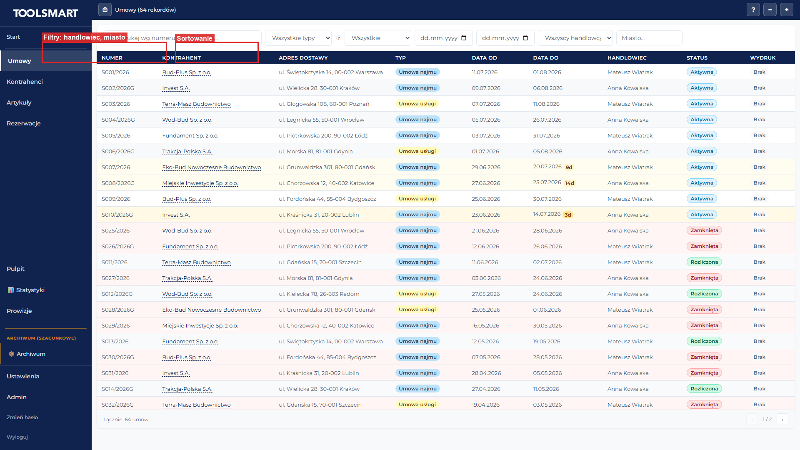

### Jak się tam dostać

- W menu bocznym po lewej stronie kliknij **„Umowy"**.
- Z ekranu głównego kliknij przycisk „Wszystkie umowy →" lub kafelek „Umowy".

### Co widzisz po wejściu

- Na samej górze poziomy pasek narzędzi z przyciskami: drukarka (⎙), liczba rekordów, znak zapytania (?), minus (−) i plus (+).
- Poniżej wiersz filtrów i wyszukiwarka.
- Pod filtrami duża tabela z listą umów.
- Na samym dole stopka z licznikiem elementów i strzałkami do przechodzenia między stronami (‹ ›).

### Filtry i wyszukiwarka

**Pole „Szukaj wg numeru, kontrahenta..."** — wpisz fragment numeru umowy lub nazwy kontrahenta, aby zawęzić listę. Wyszukiwanie uruchamia się automatycznie po ok. pół sekundy. Przykład: `2024/001` lub `Kowalski`.

**Lista rozwijana „Wszystkie typy"** — wybierz typ umowy:
- „Wszystkie typy" (domyślnie)
- „Umowy najmu (S)" — klient płaci za dni/miesiące użytkowania
- „Umowy usługi (U)" — klient płaci za wykonaną usługę (godziny pracy + operator)

**Lista rozwijana statusu rozliczenia** — trzy opcje: „Aktywne", „Rozliczone", „Wszystkie" (domyślnie).

**Pole „Data od"** — kliknij i wybierz datę; pokażą się tylko umowy zaczynające się od tej daty.

**Pole „Data do"** — kliknij i wybierz datę; pokażą się tylko umowy kończące się do tej daty.

**Lista rozwijana „Wszyscy handlowcy"** — wybierz konkretnego handlowca, aby pokazać tylko jego umowy.

**Pole „Miasto..."** — wpisz fragment nazwy miasta, aby filtrować po mieście kontrahenta.

### Przyciski

**⎙ (ikona drukarki)** — generuje dokument PDF dla aktualnie zaznaczonej umowy. Zaznacz najpierw umowę (kliknij jej wiersz), a potem kliknij drukarkę.

**? (znak zapytania)** — otwiera szczegóły zaznaczonej umowy (przechodzi do ekranu edycji).

**− (minus)** — usuwa zaznaczony element. Najpierw kliknij wiersz, aby go zaznaczyć, potem kliknij minus. Pojawi się okienko z pytaniem „Czy na pewno chcesz usunąć ten element? Tej operacji nie można cofnąć." Kliknij „Potwierdź", aby usunąć.

**+ (plus)** — dodaje nową umowę. Po kliknięciu przechodzi do pustego formularza.

### Menu kontekstowe (prawy przycisk myszy)

Kliknij **prawym przyciskiem myszy** na wiersz umowy — pojawi się menu z opcjami:
- **📄 Umowa** — generuje i otwiera dokument PDF umowy.
- **📋 Protokół ZO** — generuje protokół zdawczo-odbiorczy z danymi.
- **📋 Protokół ZO (bez danych)** — generuje protokół bez wypełnionych danych.
- **✏️ Edytuj umowę** — przechodzi do ekranu edycji tej umowy.

### Sortowanie

Kliknij nagłówek kolumny z ikoną strzałki (np. „Numer", „Kontrahent", „Data od", „Data do", „Handlowiec"). Po kliknięciu pojawi się strzałka ▲ (rosnąco) lub ▼ (malejąco). Ponowne kliknięcie odwraca kierunek. Domyślnie umowy sortowane są po dacie od (najnowsze na górze).

### Paginacja

Na jednej stronie pokazanych jest do 50 elementów. W stopce widzisz łączną liczbę i liczbę po filtrach, np. „Łącznie: 120 umów (8 po filtrach)". Strzałkami ‹ › przechodzisz między stronami.

### Workflow — dodanie nowej umowy

1. Kliknij w menu po lewej **„Umowy"** — otworzy się lista umów.
2. Kliknij przycisk **+** w prawym górnym rogu — przeniesie Cię do pustego formularza nowej umowy.
3. Wypełnij formularz umowy (opisany w rozdziale 11).
4. Zapisz umowę — wrócisz do listy, a nowa umowa pojawi się na górze.

### Workflow — edycja istniejącej umowy

1. Na liście umów znajdź wiersz umowy (możesz użyć wyszukiwarki).
2. Kliknij **dwukrotnie** wiersz umowy LUB kliknij go raz (podświetli się), a potem kliknij **?** w górnym pasku — przeniesie Cię do formularza edycji.
3. Zmień potrzebne dane i zapisz.

### Workflow — wydruk umowy

1. Zaznacz umowę klikając jej wiersz raz.
2. Kliknij **⎙** w górnym pasku — otworzy się dokument PDF gotowy do wydruku.
   Alternatywnie: kliknij prawym przyciskiem na wiersz umowy i wybierz **„📄 Umowa"**.

### Skróty klawiszowe

- **Ctrl + N** — tworzy nowy element dla aktualnie otwartej listy.
- **Dwuklik** na wierszu — otwiera edycję elementu.
- **Prawy przycisk myszy** na wierszu umowy — szybkie menu druku i edycji.
- **Enter** na zaznaczonym wierszu — otwiera edycję.
- **Esc** — zamyka menu pod prawym przyciskiem myszy.

### Stany ekranu

- **Ładowanie:** w miejscu tabeli zobaczysz animowane szare paski z napisem „Ładowanie umów".
- **Brak umów:** napis „Brak umów" z przyciskiem **„+ Nowa umowa"**.
- **Brak wyników filtrowania:** napis „Brak umów spełniających filtry" — wyczyść filtry, aby zobaczyć listę.
- **Błąd:** w tabeli pojawi się komunikat błędu z przyciskiem ponawiania — kliknij, aby spróbować załadować dane ponownie.

---

## 6. Lista kontrahentów

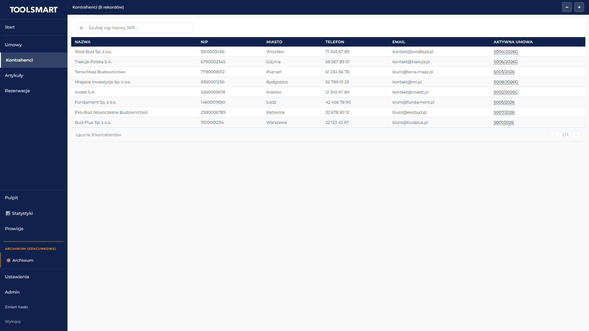

### Jak się tam dostać

- W menu bocznym po lewej stronie kliknij **„Kontrahenci"**.
- Z ekranu głównego kliknij kafelek „Kontrahenci".

### Co widzisz po wejściu

- Górny pasek narzędzi z liczbą rekordów, przyciskami minus (−) i plus (+).
- Poniżej wyszukiwarka.
- Pod wyszukiwarką duża tabela z listą kontrahentów.
- Na dole stopka z paginacją.

### Wyszukiwarka

**Pole „Szukaj wg nazwy, NIP..."** — wpisz fragment nazwy firmy lub numer NIP, aby zawęzić listę. Wyszukiwanie uruchamia się automatycznie.

### Tabela

Kolumny w tabeli:
- **Nazwa** — pełna nazwa firmy
- **NIP** — numer NIP
- **Miasto** — miasto siedziby
- **Aktywna umowa** — numer aktywnej umowy (niebieski link — po kliknięciu przenosi do listy umów z wpisanym tym numerem w wyszukiwarkę)
- **Telefon** — numer telefonu kontaktowego

### Przyciski

**− (minus)** — usuwa zaznaczonego kontrahenta. Pojawi się okienko z potwierdzeniem.

**+ (plus)** — dodaje nowego kontrahenta. Po kliknięciu przechodzi do pustego formularza (patrz rozdział 8).

### Workflow — przejście z kontrahenta do jego aktywnej umowy

1. Otwórz listę kontrahentów.
2. Znajdź kontrahenta — w kolumnie „Aktywna umowa" zobaczysz numer (jeśli istnieje).
3. Kliknij niebieski numer umowy — przeniesie Cię do listy umów z wpisanym w wyszukiwarkę tym numerem.

### Stany ekranu

- **Ładowanie:** animowane szare paski z napisem „Ładowanie kontrahentów".
- **Brak kontrahentów:** napis „Brak kontrahentów" z przyciskiem **„+ Nowy kontrahent"**.

---

## 7. Lista maszyn i artykułów

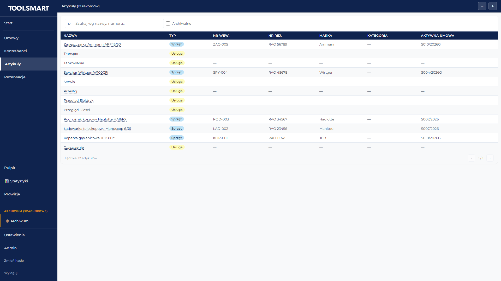

### Jak się tam dostać

- W menu bocznym po lewej stronie kliknij **„Artykuły"**.
- Z ekranu głównego kliknij kafelek „Artykuły".

### Co widzisz po wejściu

- Górny pasek narzędzi z liczbą rekordów, przyciskami minus (−) i plus (+).
- Poniżej wyszukiwarka i pole wyboru „Archiwalne".
- Pod wyszukiwarką duża tabela z listą maszyn.
- Na dole stopka z paginacją.

### Wyszukiwarka i filtry

**Pole „Szukaj wg nazwy, numeru..."** — wpisz fragment nazwy maszyny lub jej numeru.

**Pole wyboru „Archiwalne"** (kwadracik) — zaznacz, aby pokazać maszyny archiwalne (wycofane z użycia). Odznacz, aby pokazać tylko aktywne. Domyślnie odznaczone (widoczne aktywne).

### Tabela

Kolumny w tabeli:
- **Nazwa** — nazwa maszyny (niebieski link — po kliknięciu przenosi do ekranu statystyk i pokazuje historię wynajmów tej maszyny)
- **Nr wew.** — wewnętrzny numer maszyny
- **Nr rej.** — numer rejestracyjny (dla pojazdów)
- **Marka** — marka producenta
- **Kategoria** — kategoria maszyny
- **Dostępność** — status (dostępna/wypożyczona)

### Przyciski

**− (minus)** — usuwa zaznaczoną maszynę. Pojawi się okienko z potwierdzeniem.

**+ (plus)** — dodaje nową maszynę. Po kliknięciu przechodzi do pustego formularza (patrz rozdział 9).

### Stany ekranu

- **Ładowanie:** animowane szare paski z napisem „Ładowanie maszyn".
- **Brak maszyn (aktywne):** napis „Brak artykułów" z przyciskiem **„+ Nowy artykuł"**.
- **Brak maszyn archiwalnych:** napis „Brak artykułów archiwalnych".

---

## 8. Formularz kontrahenta

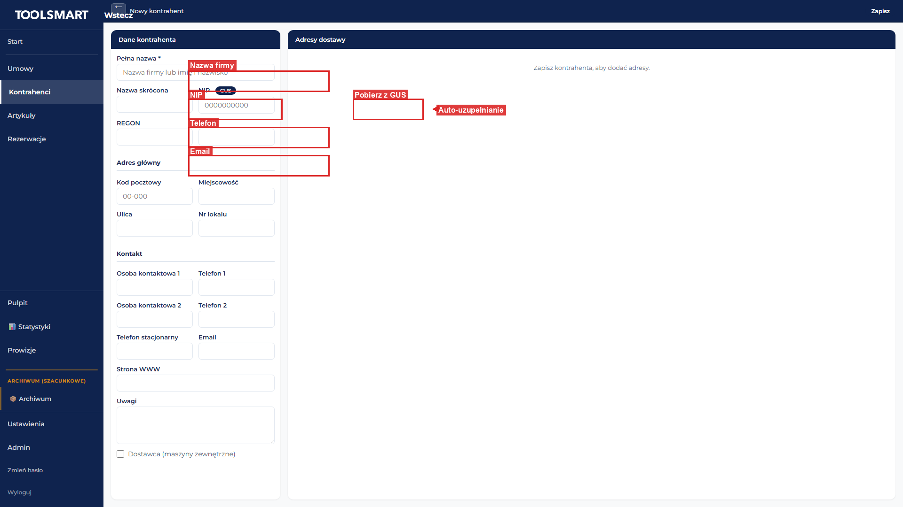

### Jak się tam dostać

- **Nowy kontrahent:** na liście kontrahentów kliknij **+** w górnym pasku, LUB użyj skrótu **Ctrl + N**.
- **Edycja istniejącego:** na liście kontrahentów kliknij **dwukrotnie** wiersz kontrahenta, LUB kliknij niebieską nazwę kontrahenta na liście umów.

### Co widzisz po wejściu

- Na samej górze poziomy pasek z przyciskiem **„← Wstecz"** po lewej, napisem pośrodku („Nowy kontrahent" lub „Edycja kontrahenta: <nazwa>"), a po prawej przyciskami. W trybie edycji pojawi się dodatkowy przycisk **„+ Umowa"**, a na samym prawym przycisk **„Zapisz"**.
- Poniżej ekran dzieli się na dwie kolumny:
  - **Lewa kolumna (szersza):** panel „Dane kontrahenta" z formularzem.
  - **Prawa kolumna (węższa):** panel „Adresy dostawy". W trybie nowego kontrahenta widzisz napis „Zapisz kontrahenta, aby dodać adresy." W trybie edycji widzisz listę adresów dostawy z przyciskiem **+** w nagłówku.

### Pola formularza (lewa kolumna — Dane kontrahenta)

**Pełna nazwa *** — wpisz pełną nazwę firmy albo imię i nazwisko (dla osoby prywatnej). Pole wymagane (oznaczone gwiazdką). Przykład: `Firma Budowlana Kowalski Sp. z o.o.`

**Nazwa skrócona** — wpisz krótką nazwę używaną na listach. Nie jest wymagane. Przykład: `Kowalski`.

**NIP** — wpisz 10-cyfrowy numer NIP (same cyfry, bez spacji i kresek). Nie jest wymagane, ale jeśli wpiszesz, musi mieć dokładnie 10 cyfr i poprawną sumę kontrolną. Obok etykiety znajduje się mały niebieski przycisk **„GUS"** (opisany niżej). Przykład: `1234563218`.

**REGON** — wpisz numer REGON firmy. Nie jest wymagane.

**PESEL** — wpisz numer PESEL (dla osób fizycznych). Nie jest wymagane.

**Kod pocztowy** — wpisz kod pocztowy w formacie `00-000`. Nie jest wymagane. Przykład: `02-100`.

**Miejscowość** — wpisz nazwę miasta. Nie jest wymagane. Przykład: `Warszawa`.

**Ulica** — wpisz nazwę ulicy. Nie jest wymagane. Przykład: `Marszałkowska`.

**Nr lokalu** — wpisz numer budynku/lokalu. Nie jest wymagane. Przykład: `15/3`.

**Osoba kontaktowa 1** — wpisz imię i nazwisko pierwszej osoby kontaktowej. Nie jest wymagane.

**Telefon 1** — wpisz numer telefonu. Nie jest wymagane. Przykład: `500 123 456`.

**Osoba kontaktowa 2** — wpisz imię i nazwisko drugiej osoby kontaktowej. Nie jest wymagane.

**Telefon 2** — wpisz drugi numer telefonu. Nie jest wymagane.

**Telefon stacjonarny** — wpisz numer telefonu stacjonarnego. Nie jest wymagane.

**Email** — wpisz adres e-mail (musi mieć poprawny format z @). Nie jest wymagane. Przykład: `biuro@kowalski.pl`.

**Strona WWW** — wpisz adres strony internetowej. Nie jest wymagane.

**Uwagi** — wpisz dowolne notatki o kontrahencie (pole tekstowe wielowierszowe). Nie jest wymagane.

**Pole wyboru „Dostawca (maszyny zewnętrzne)"** — zaznacz kwadracik, jeśli ten kontrahent jest dostawcą maszyn zewnętrznych (nie Twoim klientem wynajmującym). Domyślnie odznaczone.

### Przycisk GUS (auto-uzupełnianie z rejestru państwowego)

Obok pola NIP znajduje się niebieski przycisk **„GUS"**. Po wpisaniu poprawnego 10-cyfrowego NIP kliknij ten przycisk — aplikacja pobierze automatycznie dane firmy z rejestru państwowego (GUS) i wypełni pola: Pełna nazwa, Ulica, Kod pocztowy, Miejscowość, REGON. W trybie edycji dodatkowo utworzy adres „Siedziba (GUS)" w prawej kolumnie.

### Prawa kolumna — Adresy dostawy (tylko w trybie edycji)

Lista adresów dostawy powiązanych z kontrahentem. Każdy adres pokazuje nazwę (lub miasto), pełny adres oraz znaczniki: „Siedziba" (jeśli to adres siedziby) i „Domyślna dostawa" (jeśli to domyślny adres dostawy).

Kliknij **+** w nagłówku, aby dodać nowy adres. Otworzy się okienko z polami:
- **Nazwa adresu** — np. `Budowa Warszawa`
- **Kod pocztowy** — np. `00-001`
- **Miejscowość** — np. `Warszawa`
- **Ulica** — np. `Marszałkowska 15`
- **Kontakt** — osoba kontaktowa na tym adresie
- **Telefon** — telefon kontaktowy
- **Pole wyboru „Siedziba firmy"** — zaznacz, jeśli ten adres jest siedzibą
- **Pole wyboru „Domyślna dostawa"** — zaznacz, jeśli ten adres ma być domyślnie wybierany jako miejsce dostawy w umowach
- **„Zapisz"** — zapisuje adres
- **„Usuń"** (tylko przy edycji istniejącego adresu) — usuwa adres
- **„Anuluj"** — zamyka okienko bez zapisywania

### Przyciski paska górnego

**„← Wstecz"** — wraca do poprzedniego ekranu (zwykle do listy kontrahentów).

**„+ Umowa"** (tylko w edycji) — przechodzi do formularza nowej umowy z już wybranym tym kontrahentem. Szybki sposób, aby założyć umowę dla tego klienta.

**„Zapisz"** — zapisuje kontrahenta. Podczas zapisywania przycisk pokazuje „...". Po udanym zapisie:
- W trybie nowego kontrahenta — przenosi do trybu edycji (pojawi się napis „Edycja kontrahenta" i odblokuje się panel adresów po prawej).
- W trybie edycji — zostajesz na tym samym ekranie, dane się odświeżają.

### Workflow — dodanie nowego kontrahenta od zera

1. Na liście kontrahentów kliknij **+** (lub wciśnij Ctrl + N) — otworzy się pusty formularz.
2. Wpisz **Pełną nazwę** (wymagane).
3. Opcjonalnie wpisz NIP, REGON, PESEL, adres, dane kontaktowe.
4. Kliknij **„Zapisz"** — przycisk na chwilę pokaże „...", a po zapisaniu ekran przełączy się w tryb edycji.
5. Pojawi się prawa kolumna „Adresy dostawy" — możesz teraz dodawać adresy.

### Workflow — szybkie dodanie kontrahenta z rejestru (GUS)

1. Otwórz formularz nowego kontrahenta.
2. Wpisz sam **NIP** (10 cyfr).
3. Kliknij przycisk **„GUS"** obok pola NIP — pola nazwy, adresu i REGON wypełnią się automatycznie.
4. Sprawdź, czy dane są poprawne, uzupełnij brakujące (np. kontakt).
5. Kliknij **„Zapisz"** — kontrahent zostanie utworzony z danymi z rejestru.

### Workflow — dodanie adresu dostawy do istniejącego kontrahenta

1. Otwórz kontrahenta w trybie edycji.
2. W prawej kolumnie „Adresy dostawy" kliknij **+** w nagłówku — wyskoczy okienko.
3. Wypełnij nazwę (np. „Budowa Mokotów"), kod pocztowy, miejscowość, ulicę, opcjonalnie kontakt i telefon.
4. Zaznacz „Domyślna dostawa", jeśli ten adres ma być domyślny.
5. Kliknij **„Zapisz"** — okienko się zamknie, adres pojawi się na liście.

### Workflow — założenie umowy dla kontrahenta

1. Otwórz kontrahenta w trybie edycji.
2. Kliknij **„+ Umowa"** w górnym pasku — przeniesie Cię do formularza nowej umowy z już wybranym tym kontrahentem.
3. Dokończ wypełnianie umowy (patrz rozdział 11).

### Komunikaty

- **Błąd walidacji pola:** pod czerwonym polem pojawi się mały czerwony napis, np. „Podaj pełną nazwę kontrahenta", „NIP musi mieć 10 cyfr", „NIP nieprawidłowy (błędna suma kontrolna)".
- **Błąd GUS:** „Podaj 10-cyfrowy NIP", „NIP nieprawidłowy (błędna suma kontrolna)", lub „Błąd pobierania danych z GUS" (sprawdź, czy NIP jest poprawny i czy firma istnieje w rejestrze).
- **Błąd zapisu:** na górze formularza pojawi się czerwony pasek z napisem „Błąd zapisu" — popraw błędy i spróbuj ponownie.

### Stany ekranu

- **Ładowanie:** w trybie edycji, zaraz po wejściu, na środku zobaczysz napis **„Ładowanie..."**.
- **Brak adresów:** w prawej kolumnie napis **„Brak adresów"**.
- **Nowy kontrahent (prawa kolumna zablokowana):** napis **„Zapisz kontrahenta, aby dodać adresy."** — dodawanie adresów jest możliwe dopiero po pierwszym zapisie.

### Triki

- **GUS** — oszczędza czas: wpisz tylko NIP i kliknij GUS, reszta danych wypełni się sama.
- Kliknięcie na istniejący adres w prawej kolumnie od razu otwiera go do edycji.

---

## 9. Formularz maszyny/artukułu

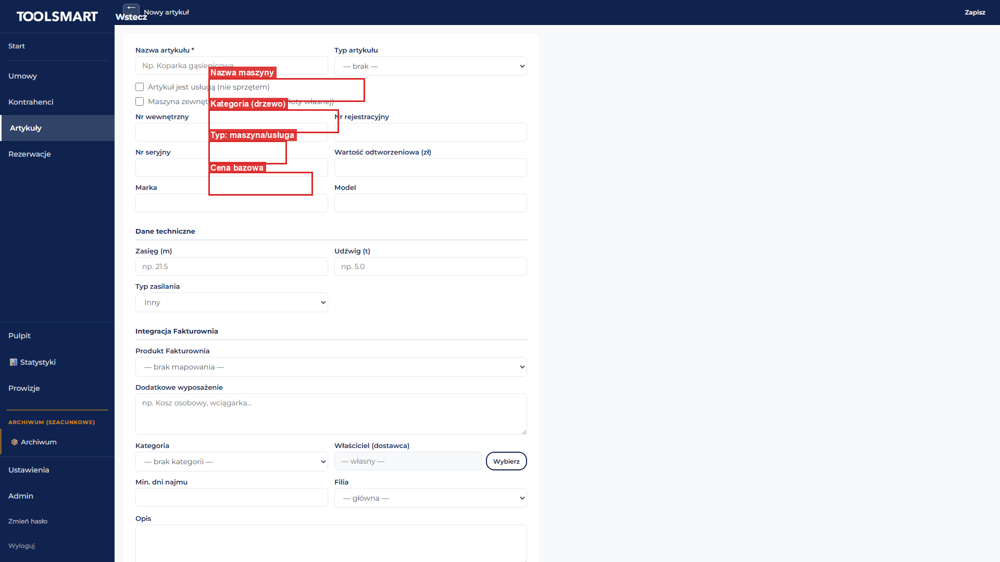

### Jak się tam dostać

- **Nowa maszyna:** na liście artykułów kliknij **+** w górnym pasku, LUB użyj skrótu **Ctrl + N**.
- **Edycja istniejącej:** na liście artykułów kliknij **dwukrotnie** wiersz artykułu.

### Co widzisz po wejściu

- Na samej górze poziomy pasek z przyciskiem **„← Wstecz"** po lewej, napisem pośrodku („Nowy artykuł" lub „Edycja artykułu: <nazwa>"), a po prawej przyciskami. W trybie edycji pojawi się dodatkowa ikona **„⎘"** (duplikuj), a na samym prawej przycisk **„Zapisz"**.
- Poniżej karta formularza z polami ułożonymi w sekcjach: dane podstawowe, pola wyboru, numery, dane techniczne, integracja z systemem księgowym, kategoria, właściciel, ustawienia najmu, opisy.
- W trybie edycji maszyny (nie usługi) na samym dole pojawia się sekcja **„Cenniki rozliczenia"** z listą cenników tej maszyny.

### Pola formularza

**Nazwa artykułu *** — wpisz nazwę maszyny lub sprzętu. Pole wymagane (oznaczone gwiazdką). Przykład: `Koparka gąsienicowa`.

**Typ artykułu** — wybierz z listy: „— brak —", „Maszyna", „Pojazd", „Narzędzie", „Usługa". Nie jest wymagane.

**Pole wyboru „Artykuł jest usługą (nie sprzętem)"** — zaznacz, jeśli to usługa, a nie fizyczny sprzęt. Wpływa na to, czy pojawi się sekcja cenników rozliczenia (usługi ich nie mają). Domyślnie odznaczone.

**Pole wyboru „Maszyna zewnętrzna (nie wliczana do floty własnej)"** — zaznacz, jeśli maszyna należy do dostawcy zewnętrznego. Domyślnie odznaczone.

**Nr wewnętrzny** — wpisz wewnętrzny numer maszyny w Twojej firmie. Nie jest wymagane. Przykład: `K-001`.

**Nr rejestracyjny** — wpisz numer rejestracyjny (dla pojazdów). Nie jest wymagane. Przykład: `WA 12345`.

**Nr seryjny** — wpisz numer seryjny producenta. Nie jest wymagane. Przykład: `CAT-320-2022`.

**Wartość odtworzeniowa (zł)** — wpisz kwotę w złotych (liczba z ułamkiem po kropce). Nie jest wymagane, ale jeśli wpiszesz, musi być liczbą nieujemną. Przykład: `450000.00`.

**Marka** — wpisz markę producenta. Nie jest wymagane. Przykład: `Caterpillar`.

**Model** — wpisz model maszyny. Nie jest wymagane. Przykład: `320D`.

**Zasięg (m)** — wpisz zasięg w metrach. Nie jest wymagane. Przykład: `21.5`.

**Udźwig (t)** — wpisz udźwig w tonach. Nie jest wymagane. Przykład: `5.0`.

**Typ zasilania** — wybierz z listy: „Diesel", „Elektryk", „Inny". Domyślnie „Inny".

**Produkt Fakturownia** — wybierz z listy rozwijanej produkt powiązany z systemem księgowym, albo „— brak mapowania —". Po wybraniu produktu pojawią się trzy dodatkowe pola (tylko do odczytu): VAT, GTU, PKWiU — dane księgowe pobrane z wybranego produktu.

**Dodatkowe wyposażenie** — wpisz listę dodatków w polu tekstowym wielowierszowym. Nie jest wymagane. Przykład: `Kosz osobowy, wciągarka, młot hydrauliczny`.

**Kategoria** — trzy listy rozwijane jedna pod drugą (kaskadowe):
1. Pierwsza lista (główna) — wybierz kategorię główną.
2. Po wybraniu pojawi się druga lista (podkategoria poziom 1).
3. Po wybraniu pojawi się trzecia lista (podkategoria poziom 2).
Nie jest wymagane.

**Właściciel (dostawca)** — pole tekstowe (nieedytowalne) pokazujące nazwę właściciela maszyny, z przyciskami:
- **„Wybierz"** — otwiera okienko wyboru właściciela z listy kontrahentów-dostawców.
- **„✕"** — czyści wybranego właściciela. Domyślnie pole pokazuje „— własny —".

**Min. dni najmu** — wpisz minimalną liczbę dni wynajmu (liczba całkowita ≥ 1). Nie jest wymagane. Przykład: `3`.

**Filia** — wybierz z listy filię firmy, do której należy maszyna, albo „— główna —". Nie jest wymagane.

**Opis** — wpisz dłuższy opis maszyny (pole tekstowe wielowierszowe). Nie jest wymagane.

**Uwagi** — wpisz notatki wewnętrzne (pole tekstowe wielowierszowe). Nie jest wymagane.

### Sekcja „Cenniki rozliczenia" (tylko w edycji, tylko dla maszyn)

Lista predefiniowanych zestawów warunków rozliczenia tej maszyny. Pod tytułem znajduje się opis: „Predefiniowane zestawy warunków rozliczenia dla tej maszyny. Po zastosowaniu w umowie warunki są kopiowane — edycja cenniku nie wpływa na istniejące umowy."

**„+ Nowy cennik"** — przycisk dodający nowy zestaw cennika.

Każdy cennik na liście pokazuje: nazwę, znacznik „Domyślny" (jeśli ustawiony), liczbę pozycji, oraz ikony:
- **✎** — zmiana nazwy cennika.
- **★** — ustawienie jako domyślny.
- **ikonka rozwijania** — pokazuje/ukrywa pozycje cennika.

### Przyciski paska górnego

**„← Wstecz"** — wraca do poprzedniego ekranu (zwykle do listy artykułów).

**„⎘" (duplikuj, tylko w edycji)** — tworzy kopię tego artykułu i przenosi do edycji nowo utworzonej kopii. Przydatne, gdy dodajesz podobną maszynę — nie musisz wypełniać wszystkiego od nowa.

**„Zapisz"** — zapisuje artykuł. Podczas zapisywania pokazuje „...". Po udanym zapisie:
- W trybie nowego — przenosi do trybu edycji (pojawi się sekcja cenników).
- W trybie edycji — zostajesz na tym samym ekranie.

### Workflow — dodanie nowej maszyny od zera

1. Na liście artykułów kliknij **+** (lub wciśnij Ctrl + N) — otworzy się pusty formularz.
2. Wpisz **Nazwę artykułu** (wymagane), np. `Koparka gąsienicowa`.
3. Wybierz **Typ artykułu** (np. „Maszyna").
4. Wypełnij numery: Nr wewnętrzny, Nr rejestracyjny, Nr seryjny.
5. Wpisz markę i model.
6. W sekcji „Dane techniczne" podaj zasięg, udźwig, typ zasilania.
7. Wybierz kategorię (główną, podkategorię 1, podkategorię 2 — jeśli istnieją).
8. Jeśli maszyna jest zewnętrzna — zaznacz „Maszyna zewnętrzna" i kliknij „Wybierz", aby wskazać właściciela-dostawcę.
9. Opcjonalnie uzupełnij opis, uwagi, dodatkowe wyposażenie, min. dni najmu, filię.
10. Kliknij **„Zapisz"** — przycisk na chwilę pokaże „...", a po zapisaniu ekran przełączy się w tryb edycji. Pojawi się sekcja „Cenniki rozliczenia" na dole.

### Workflow — szybkie dodanie podobnej maszyny (duplikowanie)

1. Otwórz istniejący artykuł w trybie edycji.
2. Kliknij **„⎘"** (duplikuj) w górnym pasku — utworzy się kopia i przeniesie Cię do jej edycji.
3. Zmień nazwę i numery na nowe (np. inny nr seryjny).
4. Kliknij **„Zapisz"**.

### Workflow — przypisanie właściciela zewnętrznego

1. Otwórz maszynę w trybie edycji (lub nową po pierwszym zapisie).
2. Zaznacz „Maszyna zewnętrzna (nie wliczana do floty własnej)".
3. Kliknij **„Wybierz"** obok pola „Właściciel (dostawca)" — otworzy się okienko.
4. Wpisz fragment nazwy w polu „Szukaj...", znajdź dostawcę na liście i kliknij jego wiersz.
5. Nazwa dostawcy pojawi się w polu właściciela.
6. Kliknij **„Zapisz"**. Aby usunąć przypisanie — kliknij **„✕"** obok pola właściciela.

### Workflow — dodanie cennika rozliczenia do maszyny

1. Otwórz maszynę w trybie edycji (nie usługę).
2. Zjedź na dół do sekcji „Cenniki rozliczenia".
3. Kliknij **„+ Nowy cennik"** — otworzy się formularz nowego cennika.
4. Wypełnij nazwę cennika i jego pozycje (stawki za dzień, miesiąc, godzinę itp.).
5. Zapisz cennik. Aby ustawić go jako domyślny — kliknij ikonę **★** przy cenniku.

### Komunikaty

- **Błąd walidacji pola:** pod czerwonym polem pojawi się napis, np. „Podaj nazwę artykułu", „Wartość odtworzeniowa musi być liczbą nieujemną", „Min. dni najmu musi być liczbą >= 1".
- **Błąd zapisu:** na górze formularza pojawi się czerwony pasek z napisem „Błąd zapisu".
- **Brak produktów księgowych:** w sekcji integracji napis „Brak produktów w Fakturownia — dodaj produkty na matsnd.fakturownia.pl".

### Triki

- **⎘ (duplikuj)** — najszybszy sposób na dodanie podobnej maszyny — oszczędza wpisywanie wszystkich danych od nowa.
- **Kaskadowa kategoria** — wybierając kategorię główną, automatycznie pojawiają się podkategorie.
- **Produkt księgowy** — po wybraniu produktu z listy, dane VAT/GTU/PKWiU uzupełniają się same — nie wpisuj ich ręcznie.

---

## 10. Rezerwacje maszyn

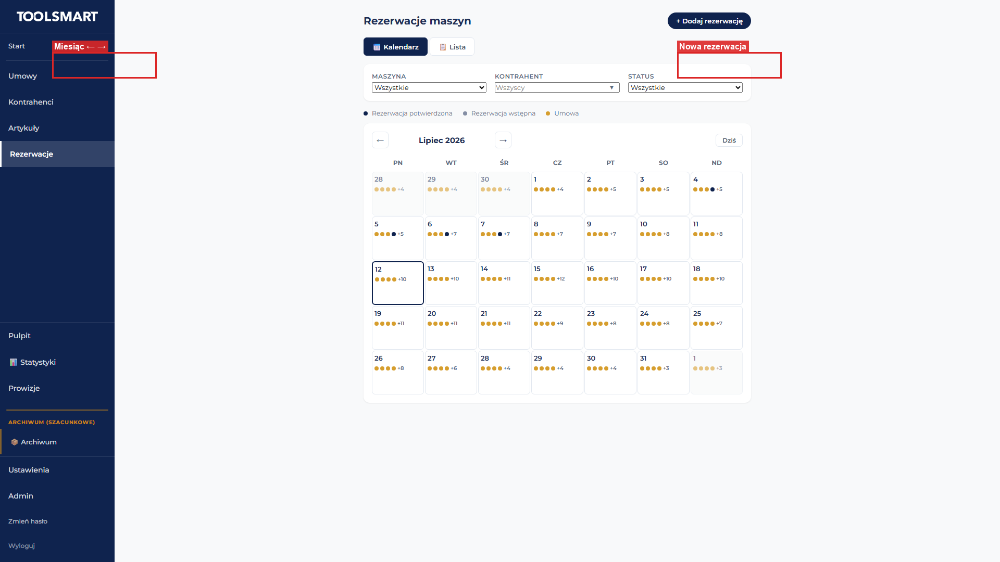

### Jak się tam dostać

- W menu bocznym po lewej stronie kliknij **„Rezerwacje"**.

### Co widzisz po wejściu

- Na górze po lewej nagłówek **„Rezerwacje maszyn"**, po prawej niebieski przycisk **„+ Dodaj rezerwację"**.
- Poniżej dwa przyciski przełączania trybu: **„📅 Kalendarz"** (domyślnie aktywny) i **„📋 Lista"**.
- Pod przyciskami pasek filtrów: **Maszyna** (lista rozwijana), **Kontrahent** (pole wyszukiwania), **Status** (lista: Wszystkie / Potwierdzone / Wstępne). W trybie listy dodatkowo **Zakres dat** (od / do).
- W trybie kalendarza pod filtrami legenda kolorów: niebieska pełna = potwierdzona, niebieska półprzezroczysta = wstępna, żółta = umowa.

### Tryb kalendarza

Duża siatka z dniami tygodnia (Pn–Nd). Nad kalendarzem: strzałki ← → (poprzedni/następny miesiąc), nazwa miesiąca i roku, przycisk **„Dziś"**. Dzisiejszy dzień ma grubszą niebieską ramkę.

W każdej komórce mogą pojawić się kolorowe kropki (max 4 widoczne, reszta jako „+N"):
- Niebieska = rezerwacja potwierdzona
- Półprzezroczysta niebieska = rezerwacja wstępna
- Żółta = umowa

**Akcje:**
- **Kliknij pusty dzień** → otwiera okno „Nowa rezerwacja" z preustawioną datą.
- **Najedź myszką na dzień** → dymek z listą rezerwacji/umów.
- **Kliknij kropkę** → otwiera okno edycji (rezerwacje) lub podglądu (umowy — tylko do odczytu).

### Tryb listy

Tabela z kolumnami: **Maszyna** (nazwa + nr wewnętrzny), **Kontrahent**, **Od**, **Do**, **Status** (plakietka), **Notatka**, **Akcje** (✏️ edytuj, 🗑️ usuń).

### Okno rezerwacji (modal)

Pola formularza:
- **Maszyna \*** (lista rozwijana, wymagane) — wybierz maszynę z listy aktywnego sprzętu.
- **Kontrahent** (pole wyszukiwania, opcjonalne) — wpisz nazwę, aby przypisać kontrahenta.
- **Data od \*** (wymagane) — data rozpoczęcia.
- **Data do \*** (wymagane) — data zakończenia (nie może być wcześniejsza niż „od").
- **Status** (lista: Potwierdzona / Wstępna, domyślnie Potwierdzona).
- **Notatka** (pole tekstowe, opcjonalne).

Przyciski: **„Usuń"** (czerwony, tylko edycja), **„Anuluj"**, **„Zapisz"** (niebieski).

### Workflow — dodanie rezerwacji

1. Kliknij **„+ Dodaj rezerwację"** (lub kliknij pusty dzień w kalendarzu).
2. Wybierz maszynę z listy (wymagane).
3. Opcjonalnie wybierz kontrahenta.
4. Wybierz datę od i datę do (wymagane).
5. Wybierz status: Potwierdzona lub Wstępna.
6. Opcjonalnie wpisz notatkę.
7. Kliknij **„Zapisz"**. Rezerwacja pojawi się w kalendarzu/liście.
8. Jeśli maszyna jest już zarezerwowana w tym terminie — pojawi się czerwony komunikat: „⚠️ Konflikt: maszyna jest już zarezerwowana w tym terminie."

### Workflow — edycja / usunięcie rezerwacji

1. W kalendarzu kliknij kropkę rezerwacji. W trybie listy kliknij ikonę **✏️**.
2. Zmieś potrzebne pola i kliknij **„Zapisz"**.
3. Aby usunąć — kliknij czerwony przycisk **„Usuń"** na dole okna i potwierdź.

### Stany ekranu

- **Ładowanie:** „Ładowanie rezerwacji…"
- **Brak rezerwacji:** „Brak rezerwacji. Dodaj pierwszą rezerwację." z przyciskiem „+ Dodaj rezerwację".
- **Brak wyników filtrów (lista):** „Brak rezerwacji pasujących do filtrów."

---

## 11. Umowy — tworzenie i edycja

### Jak się tam dostać

- **Nowa umowa:** na liście umów kliknij **+** w górnym pasku, LUB z ekranu głównego kliknij „+ Nowa umowa", LUB z formularza kontrahenta kliknij „+ Umowa".
- **Edycja:** na liście umów kliknij **dwukrotnie** wiersz umowy, LUB kliknij prawym przyciskiem → „✏️ Edytuj umowę".

### Co widzisz po wejściu

- Górny pasek narzędzi: **← (wstecz)** po lewej, tytuł pośrodku („Nowa umowa" lub „Umowa: [numer]"), po prawej ikony (tylko w edycji): **⎙ (drukuj PDF)**, **📄 (protokół ZO)**, **∑ (przelicz)**, **💰 (pobierz z Fakturownia)**, oraz niebieski przycisk **„Zapisz"**. Przy rozliczonej umowie obok numeru zielony znacznik „✓ Rozliczona".
- Poniżej przewijany obszar z białymi kartami: Dane podstawowe, Kontrahent i adres dostawy, Warunki finansowe, Kontakt i uwagi. W trybie edycji dodatkowo: Pozycje umowy/Usługi, Opłaty dodatkowe, Rozliczenie umowy.

### Karta 1: Dane podstawowe

- **Typ umowy** (lista rozwijana, wymagane) — „Umowa najmu (S)" lub „Umowa usługi (U)". Po zapisaniu zablokowane.
- **Numer umowy** (pole zablokowane) — przy nowej umowie „(auto)", przy edycji nadany numer.
- **OID Fakturownia** (opcjonalne) — identyfikator powiązania z fakturą. Puste = numer umowy.
- **Okres umowy \*** (wymagane) — data od, data do, oraz przyciski **5 / 6 / 7** (dni robocze w tygodniu).

### Karta 2: Kontrahent i adres dostawy

- **Kontrahent \*** (wymagane) — szare pole tekstowe + niebieski przycisk **„Wybierz"**. Po kliknięciu otwiera się okno z wyszukiwarką i tabelą (Nazwa, NIP, Miasto). Kliknij wiersz, aby wybrać. W oknie jest też zielony przycisk „➕ Dodaj nowego kontrahenta".
- **Adres dostawy:**
  - **Lista zapisanych adresów** (jeśli kontrahent ma adresy) — wybierz, aby auto-uzupełnić pola.
  - **Pole wyboru „Ręczny adres"** — zaznacz, aby wyłączyć auto-fill z kodu pocztowego.
  - **Kod pocztowy** — po opuszczeniu pola system automatycznie wyszukuje miasto i dane administracyjne (gmina, powiat, województwo). Pojawia się panel „Wypełnione z PNA [kod]".
  - **Miasto** — uzupełnia się automatycznie (można nadpisać ręcznie).
  - **Uwagi dojazdowe** (opcjonalne) — np. „Brama B, działka 123/4".

### Karta 3: Warunki finansowe

- **Handlowiec** (lista rozwijana, opcjonalne).
- **Oddział** (lista rozwijana, opcjonalne).
- **Wartość z rozliczenia (zł)** (pole zablokowane) — łączna wartość z zakładki rozliczenia.
- **Pozostało** (pole zablokowane) — różnica między wartością a przedpłatą.
- **Przedpłata (zł)** — wpisz kwotę przedpłaty klienta.

### Karta 4: Kontakt i uwagi

- **Reprezentowany przez** — imię i nazwisko + telefon + okienko „Drukuj" (czy dane mają być na umowie).
- **Osoba kontaktowa** — identyczny układ jak wyżej.
- **E-mail**, **Telefon** — dane kontaktowe klienta.
- **Uwagi** — pole tekstowe.
- **Opcje:** „Ukryj adres dostawy na umowie", „Podpisy wymagane na stronie 1".

### Sekcja: Pozycje umowy / Usługi (tylko w edycji)

Tabela z kolumnami: **#**, **Artykuł/Usługa**, **Dni** (najem) / **Jednostka** (usługa), **Ilość**, **Dostawca** (najem), **Data dost.** (najem), **Warunki** (liczba), **akcje** (✎ edytuj, ✕ usuń).

- **„+ Dodaj pozycję"** — otwiera okno „Wybierz artykuł" z wyszukiwarką i tabelą (Nazwa, Nr rej., Marka, Typ, Dostępność). Kliknij wiersz, aby wybrać. Jeśli maszyna jest zajęta w tym terminie — pojawi się okno konfliktu z opcjami: „Zatwierdź i usuń rezerwacje", „Zatwierdź i nie usuwaj", „Mimo to dodaj", „Anuluj".
- Po wyborze maszyny wpisz liczbę dni i ilość sztuk, kliknij **✓** lub naciśnij Enter.

### Panel warunków rozliczeniowych (kaskadowych)

Pojawia się po kliknięciu (zaznaczeniu) pozycji w tabeli powyżej.

Przyciski:
- **Rozwijana lista „Gotowe przedziały…"** — szybkie utworzenie cennika kaskadowego.
- **„↻ Z ostatniej umowy"** — kopiuje warunki z ostatniej umowy tej samej maszyny.
- **„📋 Zastosuj cennik"** — wybór predefiniowanego cennika zapisanego dla maszyny.
- **„+ Dodaj warunek"** — dodaje nowy wiersz warunku.

Tabela warunków: **Od (dni/godz.)**, **Do (dni/godz.)** (puste = „powyżej"), **Stawka (zł)**, **Ryczałt** (okienko — zaznaczone = kwota całkowita, odznaczone = stawka za jednostkę), **Jednostka**, **akcje** (✎, ✕).

Pod tabelą: **„Wartość pozycji: [kwota]"** (automatycznie przeliczona) oraz **„Podgląd PDF:"** pokazujący, jak warunki będą wyglądać na wydruku.

**Walidacja ciągłości:** Jeśli są luki lub nakładania — czerwony komunikat, np. „⚠️ Luka: po 1-3 brak 4", „⚠️ Nakładanie: po 1-3 następny powinien zaczynać się od 4", „⚠️ Warunek otwarty musi być ostatni."

### Sekcja: Opłaty dodatkowe (tylko w edycji)

Przyciski szybkich zestawów: **„Wspólne"**, **„Diesel"**, **„Elektryk"** (najem) lub **„Wspólne"** (usługa). Po kliknięciu (z potwierdzeniem, jeśli są już opłaty) w tabeli pojawiają się gotowe opłaty (Transport, Czyszczenie, Tankowanie itp.).

Tabela opłat: **Nazwa**, **Kwota od**, **Kwota do**, **Tekst na umowie** (z znacznikami `$1` i `$2` zastępowanymi kwotami), **Aktywna** (okienko), **akcje** (✎, ✕).

Dodatkowe przyciski: **„↻ Reset"** (czyszczenie do szablonu), **„+ Dodaj"** (nowa opłata).

Pod tabelą: **„Podgląd PDF:"** pokazujący, jak opłaty będą wyglądać na umowie.

### Sekcja: Rozliczenie umowy (tylko w edycji)

Nagłówek z tekstem „Koszt klienta vs koszt firmy". Jeśli umowa rozliczona — zielona plakietka „✓ Rozliczona · [data]".

Przyciski:
- **„✓ Oznacz jako rozliczoną"** (zielony) — oznacza umowę jako rozliczoną. Zmienia się na czerwony „✕ Cofnij rozliczenie".
- **„Pokaż faktury z FA"** — rozwija panel z fakturami z Fakturownia.

Tabela rozliczenia: **Pozycja**, **Wartość (zł)** (do edycji), **Koszt firmy (zł)** (do edycji), **Marża (zł)** (auto — zielona gdy dodatnia, czerwona gdy ujemna), **Uwagi**, **akcja** (🗑 usuń).

Gdy tabela pusta: **„📋 Pobierz z umowy"** (zielony) lub **„💰 Pobierz z Fakturownia"** (niebieski — zablokowany, jeśli Fakturownia nie skonfigurowana).

Zmiany w polach „Wartość" i „Koszt firmy" zapisują się automatycznie, a marża przelicza.

### Workflow — tworzenie nowej umowy (krok po kroku)

1. Kliknij „+ Nowa umowa" (na liście umów, ekranie głównym lub z formularza kontrahenta).
2. W karcie „Dane podstawowe" wybierz **Typ umowy** (najem lub usługa). Numer zostaw jako „(auto)".
3. Wybierz **datę od**, **datę do** i kliknij przycisk **5 / 6 / 7** (dni robocze).
4. W karcie „Kontrahent" kliknij **„Wybierz"** — wyszukaj i kliknij kontrahenta. Wybierz adres z listy lub wpisz kod pocztowy (miasto uzupełni się samo).
5. W karcie „Warunki finansowe" wybierz handlowca i oddział (opcjonalnie). Wpisz przedpłatę jeśli jest.
6. W karcie „Kontakt i uwagi" wpisz osoby kontaktowe (opcjonalnie). Zaznacz „Drukuj" przy danych, które mają być na umowie.
7. Kliknij **„Zapisz"** — system zapisze umowę i przejdzie do edycji. Pojawią się sekcje: Pozycje, Opłaty dodatkowe, Rozliczenie.

### Workflow — dodawanie pozycji (maszyn) do umowy

1. W sekcji „Pozycje umowy" kliknij **„+ Dodaj pozycję"**.
2. W oknie wyszukaj maszynę (np. „koparka"). Sprawdź kolumnę „Dostępność": zielona „Wolny" / czerwona „Zajęty".
3. Kliknij wiersz maszyny. Jeśli zajęta — wybierz opcję w oknie konfliktu.
4. W nowym wierszu wpisz liczbę dni i ilość sztuk. Opcjonalnie wybierz dostawcę i datę dostawy.
5. Kliknij **✓** lub naciśnij Enter. Pojawi się komunikat „Pozycja dodana".
6. Kliknij wiersz pozycji, aby go zaznaczyć — pod tabelą pojawi się panel warunków rozliczeniowych.

### Workflow — dodawanie warunków rozliczeniowych (kaskadowych)

1. Kliknij wiersz pozycji w tabeli, aby ją zaznaczyć.
2. Szybkie opcje: **„↻ Z ostatniej umowy"** (kopiuje warunki z historii maszyny), **„📋 Zastosuj cennik"** (wybór zapisanego cennika), lub lista „Gotowe przedziały…".
3. Ręcznie: kliknij **„+ Dodaj warunek"**. Wpisz Od (np. 1), Do (np. 3), Stawka (np. 800). Zaznacz/odznacz „Ryczałt".
4. Kliknij **✓** lub naciśnij Enter. Pod tabelą zaktualizuje się „Wartość pozycji".
5. Dodaj kolejne przedziały (np. 4-7 dni za 700 zł, powyżej 7 dni za 600 zł — puste „Do" = „powyżej").
6. System sprawdza ciągłość — jeśli są luki/nakładania, pojawi się czerwony komunikat.

### Workflow — dodawanie opłat dodatkowych

1. W sekcji „Opłaty dodatkowe" kliknij jeden z przycisków: **„Wspólne"**, **„Diesel"**, **„Elektryk"** (lub „Wspólne" dla usługi).
2. Jeśli są już opłaty — potwierdź zastąpienie w oknie.
3. W tabeli pojawią się gotowe opłaty. Poniżej w „Podgląd PDF:" zobaczysz, jak będą wyglądać na umowie.
4. Aby dodać ręcznie — kliknij **„+ Dodaj"**, wpisz nazwę, kwotę od/do, tekst na umowie (z `$1`/`$2`), zaznacz „Aktywna", kliknij **✓**.

### Workflow — rozliczenie umowy

1. Przejdź do sekcji „Rozliczenie umowy" na dole.
2. Jeśli tabela pusta — kliknij **„📋 Pobierz z umowy"** (zielony). System utworzy pozycje rozliczenia na podstawie umowy.
3. W kolumnie „Wartość (zł)" wpisz kwotę klienta. W „Koszt firmy (zł)" wpisz rzeczywisty koszt. Marża przeliczy się automatycznie (zielona/czerwona).
4. Opcjonalnie wpisz uwagi w kolumnie „Uwagi".
5. Aby usunąć pozycję — kliknij 🗑 i potwierdź.
6. Gdy rozliczenie kompletne — kliknij **„✓ Oznacz jako rozliczoną"**. Pojawi się zielona plakietka.
7. Aby edytować rozliczoną umowę — kliknij **„✕ Cofnij rozliczenie"** (czerwony), aby odblokować edycję.

### Workflow — generowanie PDF

- **Umowa:** kliknij **⎙** w górnym pasku. PDF zapisze się do skonfigurowanych folderów (lub pobierze standardowo).
- **Protokół ZO:** kliknij **📄** w górnym pasku. Działa identycznie jak druk umowy.
- Przy błędzie: komunikat „Błąd generowania raportu".

### Edycja umowy rozliczonej (co jest zablokowane)

Gdy umowa jest rozliczona (zielona plakietka „✓ Rozliczona"):
- Zablokowane: przyciski szybkich zestawów opłat, lista zestawów, „↻ Reset", „+ Dodaj" opłat, edycja wierszy opłat.
- Zablokowane: „+ Dodaj warunek", edycja warunków, lista „Gotowe przedziały…", „↻ Z ostatniej umowy", „📋 Zastosuj cennik".

Aby odblokować — kliknij **„✕ Cofnij rozliczenie"** w sekcji rozliczenia.

### Komunikaty (wybrane)

**Sukces:** „Pozycja dodana", „Warunek dodany", „Usługa dodana", „Zastosowano cennik (N warunków)", „Rozliczenie zainicjowane", „Zapisano do N folderu/folderów", „Pobrano N faktur o łącznej kwocie X zł".

**Błąd:** „Wybierz kontrahenta", „Błąd zapisu", „Ilość musi być ≥ 1", „Od musi być mniejsze lub równe Do", „Podaj stawkę", „Błąd generowania raportu", „Błąd pobierania faktur z Fakturownia", „Nie znaleziono kodu [kod] w bazie. Wpisz miasto ręcznie."

**Ostrzeżenia:** „⚠️ Luka: po [przedział] brak [liczba]", „⚠️ Nakładanie: po [przedział] następny powinien zaczynać się od [liczba]", „⚠️ Warunek otwarty musi być ostatni."

---

## 12. Pulpit operacyjny

### Jak się tam dostać

- W menu bocznym po lewej, w dolnej sekcji, kliknij **„Pulpit"**.

### Co widzisz po wejściu

- Nagłówek **„Pulpit operacyjny"** z dzisiejszą datą po prawej.
- Poniżej siatka kart (białe prostokąty z cieniem). Pierwsza karta („Kończące się umowy") zajmuje całą szerokość. Pozostałe ułożone po dwie w rzędzie.

### Karta 1: Kończące się umowy (pełna szerokość)

Ikona ⏰, nagłówek „Kończące się umowy", pomarańczowa plakietka z liczbą. Po prawej przyciski **„7d"**, **„14d"**, **„30d"** (zmiana horyzontu, domyślnie 14 dni).

Zawartość: siatka kartek z kolorowym paskiem po lewej (czerwony = 0-2 dni, pomarańczowy = 3-5 dni, żółty = powyżej 5 dni). Każda kartka: numer umowy, plakietka z liczbą dni (lub „Dziś!"), nazwa kontrahenta, adres dostawy (📍), data zakończenia, handlowiec, osoba kontaktowa, klikalny telefon (📞).

**Akcja:** Kliknij kartkę → przenosi do edycji umowy. Kliknij telefon → inicjuje połączenie.

### Karta 2: Dostawy

Ikona 🚚, nagłówek „Dostawy", niebieska plakietka. Przyciski: **„Dziś"**, **„Jutro"**, **„3d"**, **„7d"** (domyślnie „Jutro").

Lista wierszy z etykietą („Dziś" / „Jutro" / data), numerem umowy (klikalny link), nazwą maszyny, kontrahentem, adresem (📍), telefonem (📞).

### Karta 3: Niewydrukowane umowy

Ikona 🖨️, nagłówek „Niewydrukowane umowy", czerwona plakietka. Lista wierszy: numer umowy, kontrahent, zakres dat, przycisk **„⎙ Drukuj"**. Kliknij lewą część wiersza → edycja umowy. Kliknij „⎙ Drukuj" → generuje PDF.

### Karta 4: Nieaktualny wydruk

Ikona 🔄, nagłówek „Nieaktualny wydruk", pomarańczowa plakietka. Lista wierszy: numer umowy, kontrahent, informacja o zmianie (⚠️ + data), przycisk **„⎙ Dodrukuj"**.

### Karta 5: Przeterminowane umowy

Ikona ⚠️, nagłówek „Przeterminowane umowy", czerwona plakietka. Lista wierszy: numer umowy, kontrahent, liczba dni po terminie (⚠️ N dni po terminie), przycisk **„⎙ Drukuj"**.

### Stany ekranu

- **Ładowanie:** szare paski z animacją pulsowania (skeleton). Karty ładują się niezależnie.
- **Brak danych:** zielony ptaszek „✓" z komunikatem (np. „Brak kończących się umów w ciągu 14 dni", „Wszystkie umowy wydrukowane", „Brak dostaw w wybranym okresie", „Wszystkie wydruki aktualne", „Brak przeterminowanych umów").

---

## 13. Prowizje

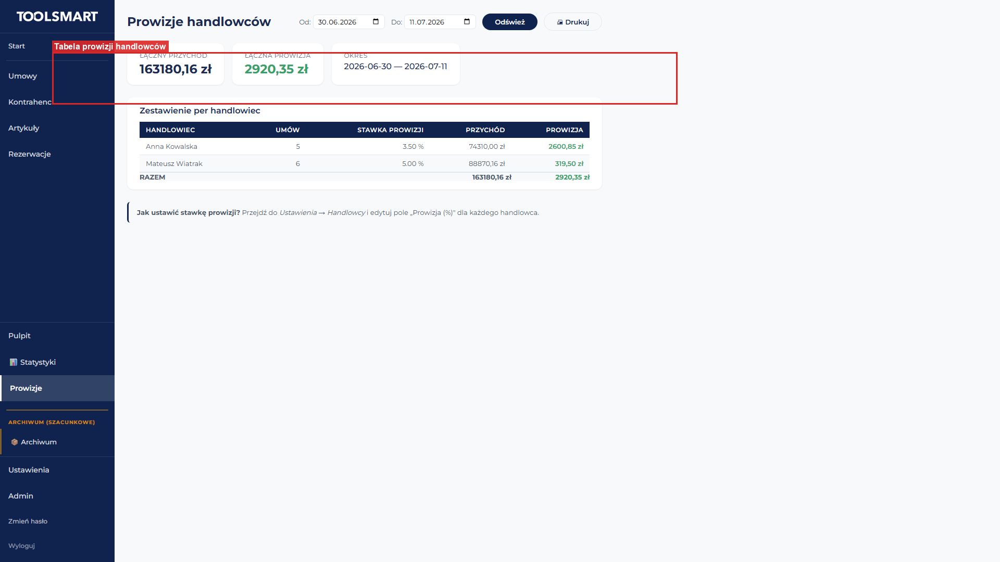

### Jak się tam dostać

- W menu bocznym po lewej, w dolnej sekcji, kliknij **„Prowizje"**.

### Co widzisz po wejściu

- Nagłówek **„Prowizje handlowców"**. Po prawej panel filtrów: **Od:** (data), **Do:** (data), przycisk **„Odśwież"**, przycisk **„🖨 Drukuj"**.
- Po zmianie dat dane odświeżają się automatycznie.

### Karty podsumowujące (KPI)

Trzy białe karty obok siebie:
- **Łączny przychód** — łączny przychód ze wszystkich umów w okresie.
- **Łączna prowizja** — łączna kwota prowizji (zielona).
- **Okres** — wybrany zakres dat.

### Tabela zestawienia

Kolumny: **Handlowiec**, **Umów** (liczba), **Stawka prowizji** (procent lub „—"), **Przychód**, **Prowizja** (zielona, pogrubiona). Na dole wiersz „RAZEM".

Pod tabelą jasnoniebieski pasek: „**Jak ustawić stawkę prowizji?** Przejdź do _Ustawienia → Handlowcy_ i edytuj pole „Prowizja (%)"."

### Workflow — sprawdzenie prowizji za okres

1. Wejdź w „Prowizje" z menu.
2. W polu „Od" wybierz datę początkową (np. 1 stycznia).
3. W polu „Do" wybierz datę końcową (np. 31 stycznia). Dane odświeżą się automatycznie.
4. Sprawdź karty KPI (łączny przychód i prowizja) oraz tabelę per handlowiec.
5. Aby wydrukować — kliknij **„🖨 Drukuj"**. Plik PDF pobierze się na komputer.
6. Jeśli handlowiec ma stawkę „—" — przejdź do Ustawienia → Handlowcy i ustaw stawkę.

### Stany ekranu

- **Ładowanie:** „Ładowanie…"
- **Brak danych:** „Brak danych dla wybranego okresu." — zmień zakres dat na szerszy.

---

## 14. Ustawienia

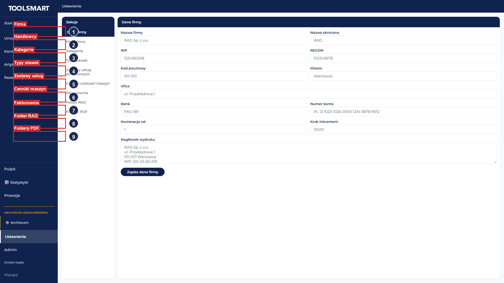

### Jak się tam dostać

- W menu bocznym po lewej, na samym dole, kliknij **„Ustawienia"**.

### Co widzisz po wejściu

Ekran podzielony na dwie kolumny:
- **Lewa** — wąski panel „Sekcje" z listą 8 zakładek. Aktywna podświetlona na ciemnoniebiesko.
- **Prawa** — panel z nagłówkiem i formularzem/tabelą zależną od zakładki.

Zakładki: **1. Dane firmy**, **2. Handlowcy**, **3. Kategorie**, **4. Typy stawek**, **5. Zestawy usług dodatkowych**, **6. Cenniki rozliczeń maszyn**, **7. Fakturownia**, **8. Foldery PDF**.

### Zakładka 1: Dane firmy

Formularz z polami: Nazwa firmy, Nazwa skrócona, NIP, REGON, Kod pocztowy, Miasto, Ulica, Bank, Numer konta, Numeracja od, Krok inkrement, Nagłówek wydruku (wieloliniowe).

Przycisk **„Zapisz dane firmy"** — po zapisie obok przycisku pojawia się zielone „✓ Zapisano" (znika po ok. 3 sekundach).

### Zakładka 2: Handlowcy

Góra: pasek dodawania (Imię i nazwisko [wymagane], Telefon, Prowizja %, przycisk „+ Dodaj").

Tabela: **Nazwa**, **Telefon**, **Prowizja %**, **Aktywny** (zielone „Tak" / szare „Nie"), **akcje** (✎ edytuj, ⇄ przełącz aktywny/nieaktywny, ✕ usuń).

### Zakładka 3: Kategorie

Góra: pole dodawania kategorii głównej (Nazwa [wymagana], Kod, przycisk „+ Dodaj główną").

Tabela z drzewem kategorii (podkategorie wcięte z symbolem „└"). Kolumny: **Nazwa**, **Kod**, **Poziom** (main/sub1/sub2/sub3), **akcje** (+ dodaj podkategorię, ✎ edytuj, ✕ usuń — zablokowane jeśli ma podkategorie).

### Zakładka 4: Typy stawek

Góra: pole dodawania (Nazwa [wymagana], przycisk „+ Dodaj").

Tabela: **Nazwa**, **Opis**, **Zależna** (Tak/Nie), **akcje** (✎, ✕).

### Zakładka 5: Zestawy usług dodatkowych

Góra: formularz nowego zestawu (Typ umowy: Najem (S) / Usługa (U), Nazwa [wymagana], Opis, przycisk „+ Nowy zestaw").

Lista kart zestawów. Każda karta: etykieta typu (niebieska „S" / pomarańczowa „U"), nazwa (pogrubiona), etykieta „Domyślny" (jeśli ustawiony), liczba pozycji, ikony (✎ zmień nazwę, ▼/▲ pokaż/ukryj pozycje, ✕ usuń).

Po rozwinięciu: tabela pozycji (Nazwa, Cena dom., Kwota od, Kwota do, Opis, Aktywna, akcje) + przycisk „+ Dodaj pozycję".

### Zakładka 6: Cenniki rozliczeń maszyn (tylko do odczytu)

Góra: pole filtru po nazwie maszyny, przycisk „↻ Odśwież".

Lista kart — po jednej dla każdej maszyny z cennikiem. Każda karta: nazwa maszyny (pogrubiona), liczba cenników, przycisk **„Edytuj →"** (przenosi do edycji maszyny). Wewnątrz: dla każdego cennika — nazwa, etykieta „Domyślny", liczba warunków, tabela warunków (Typ stawki, Stawka 1, Stawka 2, Jednostka, Okresy, Min.).

### Zakładka 7: Fakturownia

Formularz konfiguracji integracji:
- **Włącz integrację Fakturownia** (checkbox).
- **Subdomena Fakturownia** (np. „toolsmart") — pod spodem podpowiedź „Pełny URL: [subdomena].fakturownia.pl".
- **API Token** (pole hasła) — z Fakturownii.

Przycisk **„Zapisz ustawienia"** — po zapisie zielony toast „Ustawienia Fakturownia zapisane".

### Zakładka 8: Foldery PDF

Opis na górze: „Skonfiguruj foldery automatycznego zapisu PDF per oddział i typ dokumentu. Działa w Chrome i Edge."

Cztery wiersze: Folder umów (główny), Folder protokołów (główny), Folder umów (Gdańsk), Folder protokołów (Gdańsk). Każdy wiersz: ikona 📁, nazwa, status („Zapisany (nazwa)" na zielono / „Nie ustawiony" na szaro), przycisk **„Wybierz folder"** (i „Wyczyść" gdy ustawiony).

### Workflow — konfiguracja Fakturownia

1. Kliknij zakładkę „Fakturownia".
2. Zaznacz checkbox **„Włącz integrację Fakturownia"**.
3. Wpisz subdomenę (np. „toolsmart").
4. Wklej token API z Fakturownii w pole „API Token".
5. Kliknij **„Zapisz ustawienia"**. Zielony toast potwierdza zapis.

### Workflow — ustawienie folderu zapisu PDF

1. Kliknij zakładkę „Foldery PDF".
2. W wierszu „Folder umów (główny)" kliknij **„Wybierz folder"**.
3. W oknie przeglądarki wskaż folder na dysku i potwierdź.
4. Status zmieni się na „Zapisany (nazwa)", pojawi się komunikat „Folder [nazwa] zapisany."
5. Powtórz dla pozostałych 3 folderów.
6. Od teraz pliki PDF będą automatycznie zapisywane we wskazanych folderach.

> Uwaga: Auto-zapis folderów działa tylko w Chrome i Edge (File System Access API). Firefox i Safari używają standardowego pobierania.

### Stany ekranu

- **Ładowanie:** „Ladowanie danych firmy...", „Ladowanie kategorii", „Ładowanie...", „Ladowanie uzytkownikow".
- **Brak danych:** „Brak kategorii", „Brak zestawów — utwórz pierwszy zestaw powyżej.", „Brak cenników rozliczeń maszyn. Utwórz cennik w szczegółach maszyny."
- **Przeglądarka nieobsługiwana (foldery PDF):** „Twoja przeglądarka nie wspiera auto-zapisu. Użyj Chrome lub Edge."

---

## 15. Administracja użytkownikami

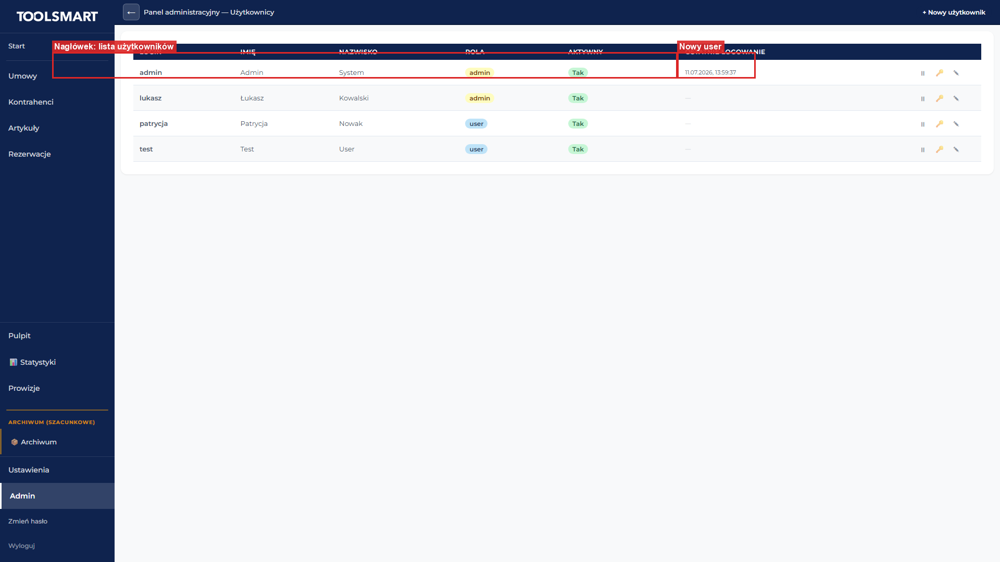

### Jak się tam dostać

- W menu bocznym po lewej kliknij **„Admin"** (widoczny tylko dla konta administratora).

### Co widzisz po wejściu

- Pasek górny: przycisk **„←"** (powrót), napis **„Panel administracyjny — Użytkownicy"**, po prawej przycisk **„+ Nowy użytkownik"**.
- Poniżej tabela z listą użytkowników.

### Tabela użytkowników

Kolumny: **Login** (pogrubiony), **Imię**, **Nazwisko**, **Rola** (pomarańczowa „admin" / niebieska „user"), **Aktywny** (zielone „Tak" / szare „Nie"), **Ostatnie logowanie** (data lub „—"), **akcje** (⏸/▶ dezaktywuj/aktywuj, 🔑 wymuś zmianę hasła, ✎ edytuj).

### Okno „Nowy użytkownik" (modal)

Pola: **Login \*** (wymagane), **Hasło \*** (wymagane), **Imię**, **Nazwisko**, **Email**, **Rola** (lista: user / admin, domyślnie user).

Przyciski: **„Anuluj"**, **„Utwórz"**. Po utworzeniu: zielony toast „Użytkownik utworzony".

Błędy: „Login i hasło są wymagane" (jeśli brak wymaganych pól), „Login already exists" (login zajęty).

### Okno „Edycja użytkownika" (modal)

Pola: **Imię**, **Nazwisko**, **Email**, **Rola** (user / admin). Loginu nie można zmienić.

Przyciski: **„Anuluj"**, **„Zapisz"**. Po zapisie: zielony toast „Dane użytkownika zaktualizowane".

### Workflow — dodanie nowego użytkownika

1. Kliknij **„+ Nowy użytkownik"** w prawym górnym rogu.
2. Wpisz login i hasło (pola wymagane, z gwiazdką).
3. Opcjonalnie uzupełnij imię, nazwisko, e-mail.
4. Wybierz rolę: „user" (zwykły) lub „admin" (pełne uprawnienia).
5. Kliknij **„Utwórz"**. Użytkownik pojawi się na liście.

### Workflow — dezaktywacja użytkownika

1. W wierszu aktywnego użytkownika (zielone „Tak") kliknij ikonę **⏸**.
2. Etykieta „Aktywny" zmieni się na szare „Nie". Użytkownik nie może się zalogować.
3. Aby przywrócić — kliknij **▶** w jego wierszu.

### Workflow — wymuszenie resetu hasła

1. W wierszu użytkownika kliknij ikonę **🔑**.
2. W okienku „Wymusić zmianę hasła dla [login]?" kliknij **„OK"**.
3. Zielony toast: „Wymuszono zmianę hasła".
4. Przy następnym logowaniu tego użytkownika system poprosi o nowe hasło.

### Stany ekranu

- **Ładowanie:** „Ladowanie uzytkownikow" (szary szkielet tabeli).
- **Brak użytkowników:** „Brak użytkowników" (rzadka sytuacja).

---

## 16. Archiwum

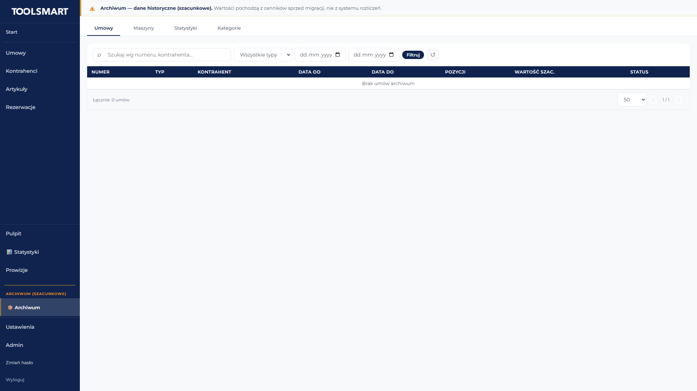

### Jak się tam dostać

- W menu bocznym po lewej, w sekcji „ARCHIWUM (szacunkowe)", kliknij **„📦 Archiwum"**.

> Ważne: Archiwum zawiera dane historyczne sprzed migracji. Wartości są **szacunkowe** — pochodzą z cenników, a nie z faktycznych rozliczeń.

### Co widzisz po wejściu

- Na górze żółty baner ostrzegawczy: „⚠️ Archiwum — dane historyczne (szacunkowe). Wartości pochodzą z cenników sprzed migracji, nie z systemu rozliczeń."
- Pasek z 4 zakładkami: **Umowy**, **Maszyny**, **Statystyki**, **Kategorie**. Domyślnie otwarta „Umowy".

### Zakładka: Umowy

Filtry: **Szukaj wg numeru, kontrahenta...**, **Wszystkie typy** (lista), **Data od**, **Data do**, przycisk **„Filtruj"**, ikona **↺** (wyczyść).

Tabela: **Numer** (pogrubiony), **Typ** (niebieska „Najem" / pomarańczowa „Usługa"), **Kontrahent**, **Data od**, **Data do**, **Pozycji**, **Wartość szac.** (z dopiskiem „[szac.]"), **Status** (zielona „Rozliczona" / szara „Nierozliczona").

**Kliknięcie wiersza** → rozwija panel szczegółów: Kontrahent, Adres, Okres, Osoba kontaktowa, Zaliczka, oraz tabele: Pozycje, Opłaty dodatkowe, Rozliczenia.

Na dole: licznik „Łącznie: N umów", lista wyboru 10/20/50 na stronę, paginacja ‹ ›.

### Zakładka: Maszyny

Filtry: **Szukaj wg nazwy, numeru wewnętrznego...**, **Wszystkie kategorie** (lista), przycisk **„Filtruj"**, ikona **↺**.

Tabela: **Nr wewn.**, **Nazwa** (pogrubiona), **Marka/Model**, **Kategoria** (dla administratora: rozwijana lista edytowalna; dla zwykłego użytkownika: tekst), **Wypożyczeń**.

### Zakładka: Statystyki

Filtry daty: **Data od**, **Data do**, przycisk **„Odśwież"**.

Karty statystyk:
1. **„📊 Podsumowanie"** — Umów, Pozycji, Przychód [szac.].
2. **„🏆 Top maszyny"** — tabela: Nazwa, Nr wewn., Wypożyczeń, Dni, Przychód [szac.]. Kliknięcie wiersza → panel boczny z umowami tej maszyny.
3. **„📁 Kategorie"** — tabela: Kategoria, Umów, Pozycji, Przychód [szac.].
4. **„📍 Miasta"** — tabela: Miasto, Umów, Pozycji, Kodów poczt., Przychód [szac.]. Kliknięcie → panel boczny z umowami w mieście.

### Zakładka: Kategorie (archiwum)

- **Administrator:** pasek dodawania (Nazwa [wymagana], Kod, lista nadrzędna, przycisk „+ Dodaj kategorię") + tabela drzewa z ikonami ✎ i ✕.
- **Zwykły użytkownik:** napis „Kategorie historyczne (szacunkowe) — read-only" + tabela tylko do odczytu.

### Panel boczny (drill-down)

Po kliknięciu wiersza w „Top maszyny" lub „Miasta" — z prawej wysuwa się panel (60% szerokości). Zawiera: nagłówek z tytułem i metrykami, pasek wyszukiwania, tabelę umów (Numer, Kontrahent, Okres, Dni, Wartość szac., Miasto). Kliknięcie wiersza → zamyka panel i przenosi do szczegółów umowy.

Zamykanie: przycisk ✕, klawisz Esc, lub kliknięcie poza panelem.

### Stany ekranu

- **Ładowanie:** „Ładowanie...", „Ładowanie statystyk...".
- **Brak danych:** „Brak umów archiwum", „Brak maszyn archiwum", „Brak kategorii archiwum", „Brak danych" (w tabelach statystyk).
- **Błąd:** „Błąd: [opis]" (czerwony).

---

## 17. Analityka i statystyki

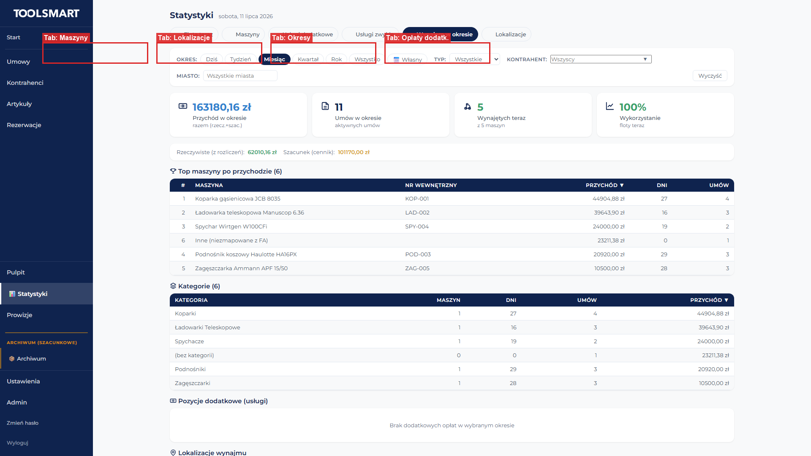

### Jak się tam dostać

- W menu bocznym po lewej kliknij **„📊 Statystyki"** (dolna sekcja). Skrót: adres `/stats` też tu przeniesie.

### Co widzisz po wejściu

- Nagłówek **„Statystyki"** + po prawej dzisiejsza data.
- Pasek zakładek (6 przycisków z ikonami): **🚜 Flota teraz**, **🏗️ Maszyny**, **📦 Usługi dodatkowe**, **🔧 Usługi zwykłe**, **📅 Wynajem w okresie** (domyślnie aktywna), **📍 Lokalizacje**.
- Pasek filtrów (ukryty tylko na „Flota teraz").
- Zawartość zakładki poniżej.

### Wspólny pasek filtrów

- **Okres:** pigułki — **Dziś**, **Tydzień**, **Miesiąc** (domyślnie), **Kwartał**, **Rok**, **Wszystko**, **📅 Własny** (po wybraniu pojawiają się pola Data od / Data do).
- **Typ:** lista — Wszystkie / Maszyny / Usługi.
- **Kontrahent:** combobox — zacznij pisać, wybierz z listy.
- **Miasto:** pole tekstowe.
- **„Wyczyść"** — resetuje filtry.

Po zmianie filtrów dane odświeżają się automatycznie.

### Zakładka: Flota teraz (🚜)

Brak paska filtrów. 3 karty KPI: **Dostępne maszyny** (zielona), **Wynajęte teraz** (niebieska), **Wykorzystanie floty** (% — zielony ≥80%, niebieski ≥50%, pomarańczowy <50%).

Pasek wykorzystania: napis „Wykorzystanie: X%" + pasek postępu.

Tabela „Maszyny aktualnie wynajęte (N)": **Maszyna**, **Nr wewnętrzny**, **Kategoria**, **Umowa**, **Kontrahent**, **Planowany zwrot**. Kliknięcie wiersza → panel boczny z historią wynajmów maszyny.

### Zakładka: Maszyny (🏗️)

4 karty KPI: **Maszyn** (z wynajmami w okresie), **Przychód** (z maszyn), **Dni wynajmu**, **Top maszyna** (nazwa + kwota, zielona).

Sekcja tabeli: tytuł „🏗️ Maszyny (N)", wyszukiwarka (po prawej), przycisk eksportu CSV, tabela: **#**, **Maszyna**, **Nr wewnętrzny**, **Kategoria**, **Przychód**, **Dni**, **Umów**, **Razy**. Sortowanie po kolumnach. Kliknięcie wiersza → panel boczny z historią.

### Zakładka: Usługi dodatkowe (📦)

4 karty KPI: **Usług dodatkowych** (w umowach najmu S), **Przychód**, **Razy zafakturowane**, **Top usługa**.

Tabela: **#**, **Usługa dodatkowa**, **Kategoria**, **Przychód**, **Umów**, **Razy**. Eksport CSV. Kliknięcie wiersza → panel boczny.

### Zakładka: Usługi zwykłe (🔧)

4 karty KPI: **Usług zwykłych** (w umowach usługi U), **Przychód**, **Umów usługi**, **Top usługa**.

Tabela: **#**, **Usługa**, **Kategoria**, **Przychód**, **Dni**, **Umów**, **Razy**. Eksport CSV. Kliknięcie wiersza → panel boczny.

### Zakładka: Wynajem w okresie (📅) — domyślna

4 karty KPI: **Przychód w okresie**, **Umów w okresie**, **Wynajętych teraz**, **Wykorzystanie**.

Opcjonalnie rozbicie przychodu: „Rzeczywiste (z rozliczeń)" (zielony) i „Szacunek (cennik)" (pomarańczowy).

5 sekcji tabel:
1. **„🏆 Top maszyny po przychodzie"** — Maszyna, Nr wewn., Przychód, Dni, Umów. Kliknięcie → drill-down.
2. **„Kategorie"** — Kategoria, Maszyn, Dni, Umów, Przychód. Kliknięcie → drill-down.
3. **„Pozycje dodatkowe (usługi)"** — Usługa, Przychód, Razy. Kliknięcie → drill-down.
4. **„Lokalizacje wynajmu"** — Miasto, Wynajmów, Przychód. Kliknięcie → drill-down.
5. **„Pozycje umów"** — Nazwa, Nr wewn., Kategoria, Przychód, Dni, Umów, Razy. Tylko do odczytu.

### Zakładka: Lokalizacje (📍)

4 karty KPI: **Lokalizacji**, **Wynajmów**, **Przychód**, **Top miasto**.

Wykres „📊 Top miasta": przełącznik metryki (Przychód / Wynajmy), 10 poziomych słupków. Kliknięcie słupka → panel boczny.

Sekcja „📍 Ranking miast/PNA (N)": przełącznik grupowania (Miasto / PNA), wyszukiwarka, tabela: **#**, **Miasto**, (opcjonalnie **PNA**), **Gmina**, **Powiat**, **Województwo**, **Wynajmów**, **Przychód**. Sortowanie po kolumnach. Kliknięcie → drill-down.

### Panel boczny (drill-down)

Po kliknięciu wiersza maszyny/usługi/lokalizacji/kategorii — z prawej wysuwa się panel (60% szerokości). Reszta ekranu przyciemniona.

Zawartość zależna od typu:
- **Maszyna:** 4 wskaźniki (Przychód, Dni, Umów, Średnio/dzień) + sekcja ROI (jeśli maszyna ma wartość zastępczą) + tabela historii wynajmów.
- **Lokalizacja:** wskaźniki (Umów, Kontrahentów, Przychód, Średnio/umowę) + rozbicie na kody PNA + top maszyny + top kontrahenci.
- **Usługa:** wskaźniki (Przychód, Razy) + top kontrahenci + lokalizacje.
- **Kategoria:** wskaźniki (Przychód kategorii, Maszyn) + tabela maszyn w kategorii.

Zamykanie: przycisk ✕, klawisz Esc, lub kliknięcie poza panelem.

### Stany ekranu

- **Ładowanie:** „Ładowanie statystyk...", „Ładowanie maszyn…", „Ładowanie usług dodatkowych…", „Ładowanie usług zwykłych…", „Ładowanie stanu floty…", „Ładowanie lokalizacji…".
- **Brak danych:** „Brak danych o maszynach w wybranym okresie.", „Brak aktywnych wynajmów — wszystkie maszyny dostępne", „Brak lokalizacji w wybranym okresie." + podpowiedź „Lokalizacje wykrywane są z adresu dostawy umowy (kod pocztowy)."
- **Błąd:** czerwony komunikat z przyciskiem ponowienia. W panelach drill-down: „Nie udało się pobrać danych. Spróbuj ponownie."

### Triki

- **Eksport CSV** — na zakładkach Maszyny, Usługi dodatkowe, Usługi zwykłe kliknij przycisk eksportu, aby pobrać dane tabeli jako plik CSV (np. `maszyny.csv`).
- **Drill-down** — kliknięcie dowolnego wiersza w tabelach otwiera panel boczny ze szczegółami — możesz zejść poziom niżej i zobaczyć konkretne umowy.
- **Pigulki okresu** — szybkie przełączanie między Dziś / Tydzień / Miesiąc / Kwartał / Rok / Wszystko bez ręcznego wpisywania dat.

---

## 18. FAQ — najczęstsze problemy

### Nie mogę się zalogować
- Sprawdź, czy nie ma literówki w loginie lub haśle.
- Sprawdź, czy klawisz Caps Lock nie jest wciśnięty.
- Jeśli nadal nie działa — skorzystaj z linku „Nie pamiętam hasła" na ekranie logowania.

### Link do resetu hasła nie działa
- Linki są jednorazowe i wygasają po 1 godzinie.
- Wyślij sobie nowy link: na ekranie logowania kliknij „Nie pamiętam hasła" i podaj swój e-mail.
- Sprawdź folder Spam w swojej skrzynce e-mail.

### Nie widzę danych na ekranie głównym
- Dane ładują się po wejściu na ekran — poczekaj chwilę.
- Jeśli panele pozostają w stanie ładowania (szare paski), naciśnij **F5**, aby odświeżyć stronę.
- Poszczególne panele ładują się niezależnie — awaria jednego nie blokuje pozostałych.

### Nie mogę dodać adresu dostawy do kontrahenta
- Adresy można dodawać dopiero po pierwszym zapisie kontrahenta.
- Jeśli widzisz napis „Zapisz kontrahenta, aby dodać adresy" — kliknij „Zapisz" najpierw, potem dodaj adresy.

### GUS nie pobiera danych
- Sprawdź, czy NIP ma dokładnie 10 cyfr (bez spacji i kresek).
- Sprawdź, czy NIP ma poprawną sumę kontrolną.
- Jeśli firma nie istnieje w rejestrze GUS — dane nie zostaną pobrane. Wypełnij dane ręcznie.

### Nie mogę wydrukować umowy
- Najpierw zaznacz umowę klikając jej wiersz na liście umów.
- Potem kliknij ikonę drukarki (⎙) w górnym pasku.
- Alternatywnie: kliknij prawym przyciskiem myszy na wiersz umowy i wybierz „📄 Umowa".

### Umowa jest rozliczona i nie mogę jej edytować
- Rozliczone umowy są zablokowane do edycji (oznaczone statusem „Rozliczone").
- Aby edytować rozliczoną umowę, najpierw cofnij rozliczenie (w formularzu umowy), dokonaj zmian, a potem rozlicz ponownie.

### Jak szybko dodać podobną maszynę?
- Otwórz istniejącą maszynę w trybie edycji.
- Kliknij ikonę **„⎘"** (duplikuj) w górnym pasku.
- Zmień nazwę i numery na nowe.
- Zapisz — nowa maszyna będzie miała wszystkie dane skopiowane z oryginału.

### Nie mogę dodać pozycji do umowy — pojawia się okno konfliktu
- Wybrana maszyna jest już przypisana do innej umowy lub rezerwacji w tym samym terminie.
- Wybierz jedną z opcji: „Zatwierdź i usuń rezerwacje" (jeśli dostępne), „Zatwierdź i nie usuwaj rezerwacji", „Mimo to dodaj", lub „Anuluj" i wybierz inną maszynę.

### Warunki rozliczeniowe pokazują czerwone ostrzeżenie
- „⚠️ Luka: po 1-3 brak 4" — brakuje warunku dla przedziału 4. Dodaj warunek zaczynający się od 4.
- „⚠️ Nakładanie" — dwa warunki pokrywają się. Popraw wartość „Od" w drugim warunku.
- „⚠️ Warunek otwarty musi być ostatni" — warunek z pustym „Do" (przedział otwarty) musi być na końcu listy.

### Nie mogę edytować rozliczonej umowy
- Rozliczone umowy mają zablokowaną edycję pozycji, warunków i opłat.
- Kliknij czerwony przycisk **„✕ Cofnij rozliczenie"** w sekcji rozliczenia, aby odblokować edycję. Po zmianach rozlicz ponownie.

### Fakturownia nie pobiera faktur
- Sprawdź, czy integracja jest włączona: Ustawienia → Fakturownia → checkbox „Włącz integrację" zaznaczony.
- Sprawdź, czy subdomena i token API są poprawne.
- Zapisz ustawienia i spróbuj ponownie.

### Pliki PDF nie zapisują się automatycznie do folderów
- Auto-zapis folderów działa tylko w Chrome i Edge (File System Access API). Firefox i Safari używają standardowego pobierania.
- Sprawdź, czy foldery są ustawione: Ustawienia → Foldery PDF. Status powinien być „Zapisany (nazwa)" na zielono.
- Jeśli status to „Nie ustawiony" — kliknij „Wybierz folder" i wskaż folder na dysku.

### Nie widzę przycisku „Admin" w menu
- Przycisk „Admin" jest widoczny tylko dla konta administratora.
- Twoje konto nie ma uprawnień administratora. Skontaktuj się z administratorem systemu.

### Archiwum pokazuje „wartości szacunkowe" — co to znaczy?
- Archiwum zawiera dane historyczne sprzed migracji do nowego systemu.
- Wartości pochodzą z cenników (szacunkowe), a nie z faktycznych rozliczeń.
- Żółty baner na górze archiwum przypomina o tym: nie traktuj tych kwot jako dokładnych.

### Jak wyeksportować dane statystyk do Excela?
- Na zakładkach Maszyny, Usługi dodatkowe, Usługi zwykłe w Statystykach kliknij przycisk eksportu CSV.
- Plik CSV pobierze się na komputer (np. `maszyny.csv`). Otwórz go w Excel lub innym programie arkuszy kalkulacyjnych.

---

> **Dokument ukończony.** Wersja 1.0 — wszystkie 18 sekcji opisuje pełną funkcjonalność aplikacji RAO.
