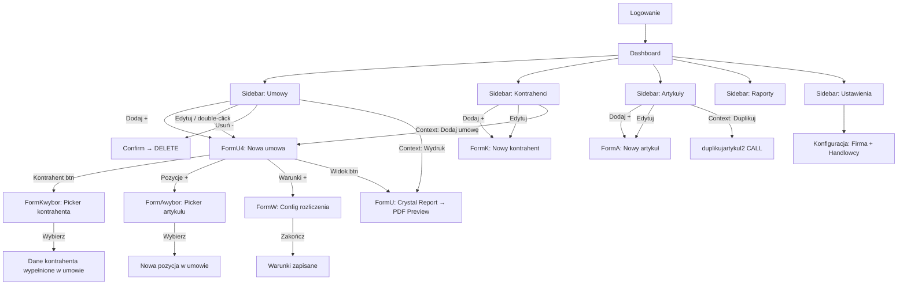

# RAO — Cross-Check: Kod ↔ SQL ↔ Widoki ↔ Procedury ↔ Baza + Projekt ekranów

> **Data:** 2026-03-14 | **Wersja:** 1.0

---

## 1. Cross-Check: GUI ↔ SQL w kodzie ↔ Obiekty bazodanowe

### 1.1 Form2.cs (Dashboard)

| Akcja GUI | SQL w kodzie | Obiekt DB | Status |
|-----------|-------------|-----------|--------|
| Przycisk "Umowy" → załaduj listę | `SELECT * FROM umowy` | **VIEW** `umowy` | ✅ View istnieje, joins umowa2+kontrahent+oddział |
| Przycisk "Kontrahenci" → załaduj listę | `SELECT * FROM kontrahenci` | **VIEW** `kontrahenci` | ✅ View istnieje, join kontrahent2+adres(siedziba) |
| Przycisk "Artykuły" → załaduj listę | `SELECT * FROM artykuly` / `artykulyy` | **VIEW** `artykuly` / `artykulyy` | ✅ View istnieje, join artykul3+kategoria+kontrahent2 |
| Filtrowanie wierszy | `DefaultView.RowFilter = "..."` (client-side) | Brak SQL | ✅ Logika lokalna na DataTable |
| Kalendarz → filtrowanie po dacie | `DefaultView.RowFilter += data_od` | Brak SQL | ✅ Logika lokalna |
| Usuwanie umowy | `DELETE FROM umowa_pozycja2_warunek`, `_pozycja3`, `umowa_oddzial`, `umowa2` | **TABELE** w kaskadzie | ✅ Poprawna kolejność FK |
| Usuwanie kontrahenta | `DELETE FROM adres`, `DELETE FROM kontrahent2` | **TABELE** | ✅ Kaskada |
| Usuwanie artykułu | `DELETE FROM artykul3` | **TABELA** | ✅ Sprawdzenie FK w `umowa_pozycja3` brak |
| Podgląd raportu | `SELECT numer,typ FROM umowa2 WHERE id=X` → CrystalReport | **TABELA** + `.rpt` | ✅ |
| Context menu → Duplikuj artykuł | `CALL duplikujartykul2(id)` | **PROCEDURA** `duplikujartykul2` | ✅ Procedura istnieje |
| Raporty dropdown | Kontrahenci/Maszyny summary → Crystal Reports | `.rpt` | ✅ |

### 1.2 FormK.cs (Kontrahenci CRUD)

| Akcja GUI | SQL w kodzie | Obiekt DB | Status |
|-----------|-------------|-----------|--------|
| Ładowanie kontrahenta | `SELECT * FROM kontrahenci WHERE id=X` | **VIEW** `kontrahenci` | ✅ |
| Ładowanie adresów | `SELECT * FROM adres WHERE id_kontrahenta=X` | **TABELA** `adres` | ✅ |
| Sprawdzenie NIP unique | `SELECT count(*) FROM kontrahent2 WHERE nip=X` | **TABELA** | ✅ |
| Zapis nowego kontrahenta | `INSERT INTO kontrahent2 (nazwa, nip, regon, ...)` | **TABELA** | ✅ |
| Update kontrahenta | `UPDATE kontrahent2 SET ... WHERE id=X` | **TABELA** | ✅ |
| Zapis nowego adresu | `INSERT INTO adres (id_kontrahenta, nazwa, ...)` | **TABELA** | ✅ |
| Update adresu | `UPDATE adres SET ... WHERE id=X` | **TABELA** | ✅ |
| Usunięcie adresu | `DELETE FROM adres WHERE id=X` | **TABELA** | ✅ |
| GUS lookup | SOAP → `Zaloguj`, `DaneSzukajPodmioty`, `DanePobierzPelnyRaport` | **Zewnętrzne API** | ✅ |

### 1.3 FormU4.cs (Umowy CRUD)

| Akcja GUI | SQL w kodzie | Obiekt DB | Status |
|-----------|-------------|-----------|--------|
| Generowanie numeru | `SELECT numeracja FROM firma WHERE id=1` + `SELECT max(autonumer)` | **TABELE** `firma`, `umowa2` | ✅ |
| Ładowanie umowy | `SELECT * FROM umowy WHERE id=X` | **VIEW** `umowy` | ✅ |
| Ładowanie pozycji | `SELECT * FROM pozycje WHERE id_umowy=X` / `pozycje2` | **VIEW** `pozycje` / `pozycje2` | ✅ |
| Ładowanie warunków | `SELECT * FROM warunki WHERE id_pozycji=X` | **VIEW** `warunki` | ✅ |
| Ładowanie adresów kontrahenta | `SELECT * FROM adres WHERE id_kontrahenta=X` | **TABELA** | ✅ |
| Ładowanie handlowców | `SELECT id,nazwa FROM handlowiec WHERE aktywny=1` | **TABELA** | ✅ |
| Ładowanie oddziałów | `SELECT id,nazwa FROM oddzial` | **TABELA** | ✅ |
| Zapis INSERT umowy | `INSERT INTO umowa2 (...)` | **TABELA** | ✅ |
| Zapis UPDATE umowy | `UPDATE umowa2 SET ... WHERE id=X` | **TABELA** | ✅ |
| Zapis oddziału | `INSERT/DELETE FROM umowa_oddzial` | **TABELA** | ✅ |
| Zapis dostawy | `INSERT/UPDATE dostawa` | **TABELA** | ✅ |
| Reverse geocoding | HTTP→ Nominatim `reverse?lat=X&lon=Y` | **Zewnętrzne API** | ✅ |
| Kalkulacja wartości | `SELECT * FROM warunki WHERE id_pozycji=X` → client logic | **VIEW** + logika | ✅ |
| Dodaj pozycję | `INSERT INTO umowa_pozycja3` (via FormAwybor) | **TABELA** | ✅ |
| Usuń pozycję | `DELETE FROM umowa_pozycja2_warunek` + `DELETE FROM umowa_pozycja3` | **TABELE** kaskada | ✅ |

### 1.4 FormW.cs (Warunki rozliczenia)

| Akcja GUI | SQL w kodzie | Obiekt DB | Status |
|-----------|-------------|-----------|--------|
| Ładowanie pozycji | `SELECT * FROM pozycje2 WHERE id=X` | **VIEW** `pozycje2` | ✅ |
| Ładowanie stawek | `SELECT id,nazwa,opis FROM stawka WHERE id<>4` | **TABELA** `stawka` | ✅ |
| Ładowanie warunków | `SELECT * FROM warunki WHERE id_pozycji=X` | **VIEW** `warunki` | ✅ |
| Historia rozliczeń | `SELECT p.id,u.numer,u.data_wprowadzenia FROM umowa2 u JOIN umowa_pozycja3 p` | **TABELE** | ✅ |
| Update pozycji stawka | `UPDATE umowa_pozycja3 SET ID_STAWKI=X,ROZLICZANIE=Y,OPLATAZA=Z` | **TABELA** | ✅ |
| Delete warunki | `DELETE FROM umowa_pozycja2_warunek WHERE id_pozycji=X` | **TABELA** | ✅ |
| Insert warunki | `INSERT INTO umowa_pozycja2_warunek` | **TABELA** | ✅ |
| Max liczba_dni | `SELECT max(liczba_dni) FROM umowa_pozycja2_warunek` | **TABELA** | ✅ |

### 1.5 FormA.cs + FormAwybor.cs (Artykuły)

| Akcja GUI | SQL w kodzie | Obiekt DB | Status |
|-----------|-------------|-----------|--------|
| Ładowanie artykułu | `SELECT * FROM artykuly WHERE id=X` / `artykulyy` | **VIEW** | ✅ |
| Zapis artykułu | `INSERT/UPDATE artykul3` | **TABELA** | ✅ |
| Ładowanie kategorii | `SELECT * FROM kategoria` | **TABELA** | ✅ |
| Picker artykułów | `CALL getUmowyArtykulu7(...)` / `sprUmowyArtykulu5/6` | **PROCEDURY** | ✅ |
| Sprawdzenie dostępności | `CALL sprdostepnosc(...)` | **PROCEDURA** | ✅ |
| Duplikacja | `CALL duplikujartykul2(id)` | **PROCEDURA** | ✅ |
| Dodaj koszt | `INSERT INTO koszt (id_umowa_pozycja, kwota, opis)` | **TABELA** `koszt` | ✅ |

### 1.6 Konfiguracjacs.cs (Konfiguracja)

| Akcja GUI | SQL w kodzie | Obiekt DB | Status |
|-----------|-------------|-----------|--------|
| Ładowanie firmy | `SELECT nazwa,nip,regon,... FROM firma WHERE id=1` | **TABELA** `firma` | ✅ |
| Update firmy | `UPDATE firma SET ... WHERE id=1` | **TABELA** | ✅ |
| Update numeracji | `UPDATE firma SET numeracja=X WHERE id=1` | **TABELA** | ✅ |
| Ładowanie handlowców | `SELECT id,nazwa,telefon,aktywny FROM handlowiec` | **TABELA** | ✅ |
| Dodaj handlowca | `INSERT INTO handlowiec VALUES(null,X,Y,1)` | **TABELA** | ✅ |
| Toggle aktywności | `UPDATE handlowiec SET aktywny=X WHERE id=Y` | **TABELA** | ✅ |

### 1.7 Logowanie.cs

| Akcja GUI | SQL w kodzie | Obiekt DB | Status |
|-----------|-------------|-----------|--------|
| Login check | `SELECT * FROM uzytkownik WHERE login=X AND haslo=Y` | **TABELA** `uzytkownik` | ✅ ⚠️ plaintext! |
| Dodaj użytkownika | `INSERT INTO uzytkownik (haslo, login) VALUES(X,Y)` | **TABELA** | ✅ |
| Zmiana hasła | `UPDATE uzytkownik SET haslo=X WHERE login=Y` | **TABELA** | ✅ |

---

## 2. Problemy w danych bazodanowych — denormalizacja

### 2.1 Tabela `a` — dziennik/log (denormalizowana)

Ta tabela zawiera łańcuchy znaków zamiast typów:
- `wartosc` → `varchar(255)` — powinno być `decimal`
- `dni` → `varchar(255)` — powinno być `int`
- `stawka` → `varchar(800)` — skonkatenowane stawki jako tekst tekstowy

> **Rozwiązanie:** W nowym systemie — NIE MIGROWAĆ. To historyczny cache/log. Dane dostępne z relacji.

### 2.2 Tabela `umowa2` — pola kontaktowe jako tekst

- `osoba1`, `osoba2`, `telefon1`, `telefon2` — kontakty umowy to skopiowane stringi, nie FK do osób
- `adres` — cały adres jako string (duplikacja z `adres`)
- `nazwa` — copy nazwy kontrahenta

> **Rozwiązanie:** W nowym systemie zachowujemy stringi (snapshot na moment umowy) + FK do kontrahenta. To celowe — umowa ma mieć dane z momentu podpisania.

### 2.3 Tabela `umowa_pozycja3` — `ROZLICZANIE` i `OPLATAZA` jako stringi

- `ROZLICZANIE` → tekst: `"tygodniowo"` / `"dziennie"` / `"godzinowo"`
- `OPLATAZA` → tekst: `"tydzień"` / `"doba"` / `"godzina"`

> **Rozwiązanie:** W nowym systemie → **ENUM** lub osobna tabela lookup.
> ```python
> class BillingFrequency(str, Enum):
>     WEEKLY = "tygodniowo"
>     DAILY = "dziennie"
>     HOURLY = "godzinowo"
> ```

### 2.4 Tabela `umowa_oddzial` — relacja M:N, ale praktycznie 1:1

Kod zawsze ustawia jeden oddział per umowę. Tabela pośrednicząca jest zbędna.

> **Rozwiązanie:** Uproszczenie do `contracts.branch_id` (FK) — już zaplanowane w schemacie 3NF.

### 2.5 Tabela `firma` — kolumny `oplata_*` jako pola konfiguracyjne

Kolumny `oplata_tankowanie`, `oplata_transport`, `oplata_czyszczenie1`, `oplata_czyszczenie2`, `oplata_ponadnormatywny_od`, `oplata_ponadnormatywny_do`, `oplata_czy_aktywna`, `oplata_opis` — konfiguracja opłat dodatkowych wbudowana w singleton.

> **Rozwiązanie:** W nowym systemie — oddzielna tabela `additional_fees` z `fee_type`, `amount_from`, `amount_to`, `is_active`, `description`. Lub JSONB jeśli elastyczność ważniejsza.

### 2.6 Tabela `adres` — brak FK constraint

Kolumna `ID_KONTRAHENTA` nie ma `FOREIGN KEY` constraint w DB — tylko logiczny związek w kodzie.

> **Rozwiązanie:** Dodać prawdziwe FK constraints w nowym schemacie.

---

## 3. Projekt ekranów nowej aplikacji Vue.js

### Paleta kolorów (z WinForms)

| Element | WinForms | CSS |
|---------|----------|-----|
| Sidebar background | `RGB(63,59,82)` | `#3F3B52` |
| Sidebar button active | `RGB(83,68,120)` | `#534478` |
| Accent button | `RGB(240,170,113)` | `#F0AA71` |
| Accent text | `Color.Maroon` | `#800000` |
| Background | `Color.Gainsboro` | `#DCDCDC` |
| Content background | `Color.WhiteSmoke` | `#F5F5F5` |
| Grid selection | `RGB(83,68,120)` | `#534478` |
| Text primary | `Color.DimGray` | `#696969` |

---

### 3.1 Ekran: Logowanie (`LoginView.vue`)

```
┌──────────────────────────────────────────┐
│                                          │
│            ┌──────────────┐              │
│            │     RAO      │              │
│            │   ● logo ●   │              │
│            └──────────────┘              │
│                                          │
│            ┌──────────────┐              │
│            │ Login        │              │
│            └──────────────┘              │
│            ┌──────────────┐              │
│            │ Hasło        │              │
│            └──────────────┘              │
│                                          │
│            [   Zaloguj   ]               │
│                                          │
└──────────────────────────────────────────┘
```

**Identyczne z WinForms `Logowanie.cs`**: pole login, pole hasło, przycisk zatwierdzenia.

---

### 3.2 Ekran: Dashboard (`DashboardView.vue`) — GŁÓWNY EKRAN

```
┌──────────────────────────────────────────────────────────────┐
│ [pb: progress bar]                                           │
├────────┬─────────────────────────────────────────────────────┤
│  RAO   │  [w]    info: Umowy (123 rekordów)     [?] [-] [+] │
│        │                                                     │
│ ┌────┐ │  ┌─ filtr ──────────────────────────────────────┐   │
│ │Umo-│ │  │ [________________szukaj________________]     │   │
│ │wy  │ │  └──────────────────────────────────────────────┘   │
│ ├────┤ │                                                     │
│ │Kon-│ │  ┌─ kalendarz (DataGridView kali) ──────┬─ info ─┐ │
│ │tra-│ │  │  Pn  Wt  Śr  Czw  Pt  Sb  Nd       │ umowy  │ │
│ │hen-│ │  │  1   2   3   4    5   6   7         │ tego   │ │
│ │ci  │ │  │  8   9   10  11   12  13  14        │ dnia   │ │
│ ├────┤ │  │  15  16  17  18   19  20  21        │        │ │
│ │Art-│ │  │  22  23  24  25   26  27  28        │        │ │
│ │yku-│ │  │  29  30  31                          │        │ │
│ │ły  │ │  └──────────────────────────────────────┴────────┘ │
│ │    │ │                                                     │
│ │    │ │  ┌─ lista (DataGridView dgv) ───────────────────┐   │
│ │    │ │  │  Nr │ Kontrahent │ Adres │ od   │ do   │ Val │   │
│ │    │ │  │  S01│ Firma ABC  │ Wwa  │ 2026 │ 2026 │ 15k │   │
│ │    │ │  │  S02│ Firma XYZ  │ Krk  │ 2026 │ 2026 │ 20k │   │
│ │    │ │  └──────────────────────────────────────────────┘   │
│ │    │ │                                                     │
│ │    │ │  ┌─ raport combo ───────────────────────────────┐   │
│ ├────┤ │  │ [Kontrahenci - podsumowanie  ▼]              │   │
│ │Rap-│ │  └──────────────────────────────────────────────┘   │
│ │ort-│ │                                                     │
│ │y   │ │  ┌─ data od/do ────────────────────────────────┐   │
│ ├────┤ │  │ [2026-01-01] [2026-12-31]                    │   │
│ │Ust-│ │  └──────────────────────────────────────────────┘   │
│ │aw. │ │                                                     │
└────────┴─────────────────────────────────────────────────────┘
```

**Nawigacja identyczna z WinForms:**
- Lewy sidebar: **Umowy** → **Kontrahenci** → **Artykuły** → (gap) → **Raporty** → **Ustawienia**
- Top bar: przycisk widoku `[w]`, info label, `[?]` pokaż, `[-]` usuń, `[+]` dodaj
- Środek: filtr tekstowy → kalendarz → lista danych → combo raportów → daty

**Context menu (right-click na liście):**
- Umowy: `Edytuj`, `Usuń`, `Wydruk → [Umowa, Protokół ZO, Protokół ZO bez danych]`, `Wyślij`, `Pliki`
- Kontrahenci: `Edytuj`, `Usuń`, `Dodaj umowę`, `Wydruk`
- Artykuły: `Pokaż`, `Usuń`, `Duplikuj`

---

### 3.3 Ekran: Formularz kontrahenta (`ContractorFormView.vue`)

```
┌──────────────────────────────────────────────────┐
│ ┌─ Dane ───────────────────────────────────────┐ │
│ │ ☐ Dostawca                        [  GUS  ]  │ │
│ │                        GUS date label        │ │
│ │ Nazwa ┌──────────────┐  NIP    ┌──────────┐ │ │
│ │       │ Firma ABC    │         │1234567890│ │ │
│ │       │ sp. z o.o.   │  REGON  ┌──────────┐ │ │
│ │       └──────────────┘         │123456789 │ │ │
│ │ Nazwa  ┌──────────────┐ PESEL  ┌──────────┐ │ │
│ │ krótka │ ABC          │        │          │ │ │
│ │        └──────────────┘        └──────────┘ │ │
│ │ uwagi ┌──────────────┐ ┌─Osoba reprezen.─┐ │ │
│ │       │              │ │ Nazwa [_______]  │ │ │
│ │       │              │ │ Tel.  [_______]  │ │ │
│ │       └──────────────┘ └─────────────────┘ │ │
│ │ telefon ┌────────┐  email ┌────────┐      │ │
│ │         │+48     │        │        │      │ │
│ │ [pliki] www   ┌────────┐                   │ │
│ │ [ścieżka___] │        │  [ Zatwierdź ]    │ │
│ └────────────────────────────────────────────┘ │
│ ┌─ Adresy ─────────────────────────────────────┐ │
│ │ ┌─lista adresów──┐ ┌─ Adres ─────────────┐  │ │
│ │ │ □ Siedziba     │ │ [schowek] [chrome]   │  │ │
│ │ │ □ Magazyn      │ │ ☐ siedziba           │  │ │
│ │ │ □ Biuro Pn     │ │ ☐ domyślny punkt     │  │ │
│ │ │               │ │ nazwa [______________]│  │ │
│ │ │               │ │ ulica [______________]│  │ │
│ │ │               │ │ kod [____] miasto [___]│  │ │
│ │ │               │ │ ┌─Osoba kontaktowa─┐  │  │ │
│ │ │               │ │ │ Nazwa [________]  │  │  │ │
│ │ │               │ │ │ Tel.  [________]  │  │  │ │
│ │ │               │ │ └──────────────────┘  │  │ │
│ │ └───────────────┘ │ [Usuń]  [Zatwierdź]   │  │ │
│ │ Współrzędne       └───────────────────────┘  │ │
│ │ LTT [____] LNG [____] [schowek] [chrome]    │ │
│ │                          [ Nowy ]             │ │
│ └────────────────────────────────────────────────┘ │
└──────────────────────────────────────────────────┘
```

**Identyczne z WinForms `FormK`:**
- Górna połowa: dane kontrahenta (gbnaglowek) — 50% height
- Dolna połowa: adresy (gbpunkty) — 50% height
- Lista adresów po lewej → formularz adresu po prawej
- GUS przycisk w prawym górnym rogu

---

### 3.4 Ekran: Formularz umowy (`ContractFormView.vue`)

```
┌─────────────────────────────────────────────────────────────────┐
│ [info: NOWA UMOWA / edycja: S001/2026]                          │
├─────────────────────────────────────────────────────────────────┤
│ ┌─ Nagłówek ──────────────────────────────────────────────────┐ │
│ │ Numer [S001/2026] [Umowa najmu]  ☐handlowiec [Kowalski ▼]  │ │
│ │                                                             │ │
│ │ [Kontrahent] [___Firma ABC sp. z o.o.___]  [Nazwa ust.]    │ │
│ │                                                             │ │
│ │ ☐ Dostawa  [___Adres dostawy (combo)___▼]                  │ │
│ │ Adres: ulica [________] kod [____] miasto [________] [>>]  │ │
│ │ Współrzędne [____________________________________]          │ │
│ │                                                             │ │
│ │ ☐ Reprezentująca  Telefon [+48_______] │  ┌──Kalendarz──┐  │ │
│ │ ☐ Kontaktowa     Telefon [+48_______]  │  │  MARZEC     │  │ │
│ │                                         │  │  Pn-Nd      │  │ │
│ │ Usługi    ┌──────────────────────┐     │  │  ...        │  │ │
│ │ dodatkowe │ Wynajem sprzętu     │     │  ├────────────┤  │ │
│ │           │ budowlanego...      │     │  │  KWIECIEŃ  │  │ │
│ │           │                     │     │  │  ...        │  │ │
│ │           └──────────────────────┘     │  └────────────┘  │ │
│ │                                         │                  │ │
│ │ ┌─Finanse─────────────────────────┐    │  Osoba1 [_____]  │ │
│ │ │ Wartość   [    15 000,00 zł   ] │    │  Tel.1  [_____]  │ │
│ │ │ Przedpłata [______] dok [_____] │    │  Osoba2 [_____]  │ │
│ │ │ Faktura    [______] dok [_____] │    │  Tel.2  [_____]  │ │
│ │ │ Pozostało  [    15 000,00 zł  ] │    │  email  [_____]  │ │
│ │ └─────────────────────────────────┘    │                  │ │
│ │ Uwagi ┌──────────────────────┐         │ Oddział [____▼]  │ │
│ │       │                      │         │ Dni/tyg [6]      │ │
│ │       └──────────────────────┘         │                  │ │
│ │ [pliki]                    [widok]     │                  │ │
│ └────────────────────────────────────────┴──────────────────┘ │
├─────────────────────────────────────────────────────────────────┤
│ ┌─ Pozycje ─────────────────┐ ┌─ Warunki rozliczenia ────────┐ │
│ │ Lista pozycji art.  [?][-][+]│ Warunki rozliczenia    [-][+]│ │
│ │ ┌───────────────────────┐ │ ┌───────────────────────────┐  │ │
│ │ │ Nazwa │Dni│ Dostawa  │ │ │ Typ│ Opis│ Ile│Op1 │Op2  │  │ │
│ │ │ Koparka│30│ 2026-03 │ │ │ 2 │ do 5│  5│100 │ 80  │  │ │
│ │ │ Dźwig  │15│ 2026-03 │ │ │ 2 │ pow.│ 99│ 80 │     │  │ │
│ │ └───────────────────────┘ │ └───────────────────────────┘  │ │
│ └───────────────────────────┘ └──────────────────────────────┘ │
├─────────────────────────────────────────────────────────────────┤
│                    [ Zapisz i wyjdź ]                            │
└─────────────────────────────────────────────────────────────────┘
```

**Identyczne z WinForms `FormU4`:**
- Row 0 (30px): Info bar
- Row 1 (480px): Nagłówek z wszystkimi polami — kontrahent, adres, daty, finanse, kalendarz 2-miesieczny, osoby kontaktowe
- Row 2 (200px): Split 50/50 — pozycje | warunki (oba z DataGridView + toolbar `[?][-][+]`)
- Row 3 (30px): Przycisk "Zapisz i wyjdź"

---

### 3.5 Ekran: Warunki rozliczenia (`ConditionFormView.vue` — dialog/panel)

```
┌─────────────────────────────────────────────────────────────┐
│ [<] [>]     info: Koparka KAT5         typ [Stawka z pro ▼]│
├─────────────────────────────────────────────────────────────┤
│ ┌─ dane stawki ──────────────────────────────────────────┐  │
│ │ Dni [30]        naliczanie opłaty [tygodniowo ▼]       │  │
│ │                 opłata za          [tydzień    ▼]       │  │
│ │ Opis ┌─────────────────────────────────────────────┐   │  │
│ │      │ Wynajem koparki gąsienicowej CAT 320       │   │  │
│ │      │ rozliczenie tygodniowe, stawka 5 000 zł/tyg│   │  │
│ │      │ powyżej 5 tyg. stawka 4 000 zł/tyg        │   │  │
│ │      └─────────────────────────────────────────────┘   │  │
│ │                                                        │  │
│ │ Warunek [stawka 5000,00 zł/tyg. do 5 tygodni]         │  │
│ │                                                        │  │
│ │ [dodawanie progu]                                      │  │
│ │ ☐ min [5] [-][+]  Okres [-] [5] [+]                   │  │
│ │                    Opłata1 [5000,00]  ☐ Opłata2[4000] │  │
│ │                                                        │  │
│ │                  [ Dodaj ]                              │  │
│ └────────────────────────────────────────────────────────┘  │
├─────────────────────────────────────────────────────────────┤
│ ┌─ lista warunków ─────────────────────────────────────┐   │
│ │ Nazwa│Opis        │Ile │Opłata 1│Opłata 2│Rozliczana│   │
│ │ Prog │do 5 tyg    │  5 │ 5000   │        │tygodniowo│   │
│ │ Prog │pow. 5 tyg  │ 99 │ 4000   │        │tygodniowo│   │
│ └──────────────────────────────────────────────────────┘   │
├─────────────────────────────────────────────────────────────┤
│                     [ Zakończ ]                              │
└─────────────────────────────────────────────────────────────┘
```

**Identyczne z WinForms `FormW`:**
- Row 0 (30px): Nawigacja `[<][>]` + info + combo typ stawki
- Row 1 (260px): Formularz z polami: dni, naliczanie, opłata za, opis, warunek, progi z +/-
- Row 2 (fill): DataGridView z warunkami
- Row 3 (30px): Przycisk "Zakończ"

---

### 3.6 Ekran: Formularz artykułu (`ArticleFormView.vue` — dialog)

```
┌──────────────────────────────────────┐
│ ┌─ Dane artykułu ─────────────────┐ │
│ │ ☐ Usługa                        │ │
│ │                                  │ │
│ │ Nazwa       [________________]   │ │
│ │ Nr rejest.  [________________]   │ │
│ │ Marka       [________________]   │ │
│ │ Model       [________________]   │ │
│ │ Nr seryjny  [________________]   │ │
│ │ Wartość     [________________]   │ │
│ │                                  │ │
│ │ Kategoria   [Koparki    ▼] [+]   │ │
│ │ Właściciel  [Firma XYZ   ▼]      │ │
│ │                                  │ │
│ │ Uwagi      ┌──────────────────┐  │ │
│ │            │                  │  │ │
│ │            └──────────────────┘  │ │
│ │                                  │ │
│ │           [ Zatwierdź ]          │ │
│ └──────────────────────────────────┘ │
└──────────────────────────────────────┘
```

---

### 3.7 Ekran: Picker artykułów (`ArticlePickerDialog.vue`)

```
┌──────────────────────────────────────────────────┐
│ [szukaj ___________________________________]     │
│                                                  │
│ ┌─ lista artykułów ──────────────────────────┐   │
│ │ Nazwa       │Rej. nr│Kategoria│Właściciel  │   │
│ │ Koparka 320 │KAT-5  │Koparki  │RAO         │   │
│ │ ★Dźwig 40t  │DZW-12 │Dźwigi   │RAO         │   │
│ │ Rusztowanie │       │Rusztow. │Dostawca A  │   │
│ └────────────────────────────────────────────┘   │
│ ★ = artykuł z aktywną umową (kolor Moccasin)     │
│                                                  │
│ Data dostawy  [2026-03-15]                       │
│ Liczba dni    [30]                                │
│ Dostawca      [_______________▼]  (opcjonalny)   │
│                                                  │
│ [Duplikuj]              [Wybierz]  [Anuluj]      │
└──────────────────────────────────────────────────┘
```

---

### 3.8 Ekran: Konfiguracja (`SettingsView.vue`)

```
┌──────────────────────────────────────────────────────────┐
│ ┌─ Dane firmy ───────────────────────────────────────┐   │
│ │ Nazwa       [___RAO sp. z o.o.___]                 │   │
│ │ Nazwa krótka[___RAO___]                            │   │
│ │ NIP         [___1234567890___]                      │   │
│ │ REGON       [___123456789___]                       │   │
│ │ Kod poczt.  [00-000]  Miasto [___Warszawa___]      │   │
│ │ Ulica       [___ul. Przykładowa 1___]               │   │
│ │ Nagłówek    ┌──────────────────────────────┐        │   │
│ │             │ nagłówek raportu             │        │   │
│ │             └──────────────────────────────┘        │   │
│ │ Bank        [___mBank___]                           │   │
│ │ Rachunek    [___PL12 3456 7890 1234___]             │   │
│ │ Numeracja startowa [___1___]                        │   │
│ │ Folder zapisu     [___C:\raporty___]                │   │
│ │ Folder protokoły  [___C:\proto___]                  │   │
│ └─────────────────────────────────────────────────────┘   │
│                                                          │
│ ┌─ Opłaty dodatkowe ─────────────────────────────────┐   │
│ │ Tankowanie [___50___]  Transport [___100___]        │   │
│ │ Czyszczenie1 [___200___]  Czyszczenie2 [___300___] │   │
│ │ ☐ Ponadnormatywny przestój  od[__] do[__] opis[__]│   │
│ └─────────────────────────────────────────────────────┘   │
│                                                          │
│ ┌─ Usługi ───────────────────────────────────────────┐   │
│ │ Najem    ┌─────────────────────────────────────────┐│   │
│ │          │ tekst szablonu umowy najmu               ││   │
│ │ Usługa   ┌─────────────────────────────────────────┐│   │
│ │          │ tekst szablonu umowy usługowej           ││   │
│ └─────────────────────────────────────────────────────┘   │
│                                                          │
│ ┌─ Handlowcy ────────────────────────────────────────┐   │
│ │ ┌──────────────────────────────────────────────────┐│   │
│ │ │ Nazwa      │ Telefon    │ Aktywny │              ││   │
│ │ │ Kowalski   │ 500123456  │ tak     │              ││   │
│ │ │ Nowak      │ 501234567  │ nie     │              ││   │
│ │ └──────────────────────────────────────────────────┘│   │
│ │ Nazwa [________]  Tel [________]  [Dodaj]           │   │
│ │ ☐ Pokaż nieaktywnych  (context: toggle aktywność)  │   │
│ └─────────────────────────────────────────────────────┘   │
│                       [ Zapisz ]                          │
└──────────────────────────────────────────────────────────┘
```

---

## 4. Flow użytkownika (identyczny z WinForms)



---

## 5. Podsumowanie cross-check

| Aspekt | Wynik | Uwagi |
|--------|-------|-------|
| GUI ↔ SQL | ✅ 100% zgodne | Każda akcja GUI ma odpowiednią kwerendę SQL |
| SQL ↔ Views | ✅ 100% zgodne | `umowy`, `kontrahenci`, `artykuly`, `pozycje`, `warunki` — all used |
| SQL ↔ Procedures | ✅ 100% zgodne | `duplikujartykul2`, `sprUmowyArtykulu5/6`, `getUmowyArtykulu7`, `sprdostepnosc` |
| SQL ↔ Tables | ✅ 100% zgodne | Wszystkie 16 tabel mają odpowiednie INSERT/UPDATE/DELETE |
| Denormalizacja | ⚠️ 6 problemów | Opisane w sekcji 2 z rozwiązaniami |
| Screen mapping | ✅ 8 ekranów | 1:1 z WinForms + identyczny flow nawigacji |
