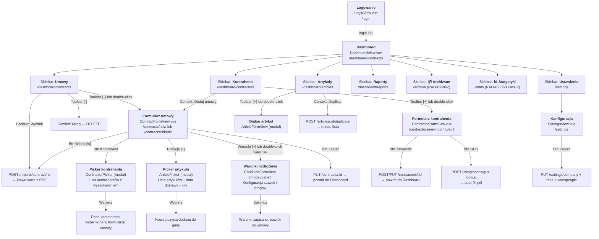

# 06 — Navigation Flow & Routing

> **INSTRUKCJA DLA AGENTA:** Flow użytkownika musi być identyczny z WinForms.
> Użytkownicy nie mogą się "zgubić" — nawigacja 1:1.

## Flow Diagram

## Mapowanie WinForms Form → Vue Route

| WinForms Form | Vue Route | Typ nawigacji |
|---------------|-----------|---------------|
| `Logowanie.cs` | `/login` | Pełna strona |
| `Form2.cs` (Umowy tab) | `/dashboard/contracts` | Sidebar + content |
| `Form2.cs` (Kontrahenci tab) | `/dashboard/contractors` | Sidebar + content |
| `Form2.cs` (Artykuły tab) | `/dashboard/articles` | Sidebar + content |
| `Form2.cs` (Raporty tab) | `/dashboard/reports` | Sidebar + content |
| `FormK.cs` | `/contractors/:id/edit` lub `/new` | Pełna strona (replace content) |
| `FormU4.cs` | `/contracts/:id/edit` lub `/new` | Pełna strona (replace content) |
| `FormA.cs` | Dialog (modal) | Overlay na Dashboard |
| `FormAwybor.cs` | Dialog (modal) w kontekście FormU4 | Overlay na ContractForm |
| `FormW.cs` | Dialog/Panel w kontekście FormU4 | Overlay lub side-panel |
| `Konfiguracjacs.cs` | `/settings` | Pełna strona |
| `FormU.cs` (Crystal Report) | Nowa karta z PDF | window.open() |

## Pełna tabela routes (router/index.js)

| Route | Name | View | Auth | Opis |
|-------|------|------|------|------|
| `/login` | `Login` | `LoginView.vue` | nie | Strona logowania |
| `/reset-password` | `ResetPassword` | `ResetPasswordView.vue` | nie | Reset hasła z tokenu (query: `?token=...`) |
| `/` | — | — | tak | Redirect → `/home` |
| `/home` | `Home` | `HomeView.vue` | tak | KPI Dashboard, quick actions |
| `/dashboard/:section` | `Dashboard` | `DashboardView.vue` | tak | Listy (contracts/contractors/articles/reports) |
| `/contractors/new` | `ContractorNew` | `ContractorFormView.vue` | tak | Nowy kontrahent |
| `/contractors/:id/edit` | `ContractorEdit` | `ContractorFormView.vue` | tak | Edycja kontrahenta |
| `/articles/new` | `ArticleNew` | `ArticleFormView.vue` | tak | Nowy artykuł |
| `/articles/:id/edit` | `ArticleEdit` | `ArticleFormView.vue` | tak | Edycja artykułu |
| `/contracts/new` | `ContractNew` | `ContractFormView.vue` | tak | Nowa umowa |
| `/contracts/:id/edit` | `ContractEdit` | `ContractFormView.vue` | tak | Edycja umowy |
| `/worker` | `Worker` | `WorkerView.vue` | tak | Pulpit operacyjny (kończące, dostawy) |
| `/stats` | `Stats` | `StatsView.vue` | tak | Statystyki (Flota teraz + Wynajem w okresie) (RAO-P2-060) |
| `/commissions` | `Commissions` | `CommissionView.vue` | tak | Raporty prowizji handlowców |
| `/settings` | `Settings` | `SettingsView.vue` | tak | Konfiguracja firmy/szablonów/handlowców |
| `/password` | `ChangePassword` | `ChangePasswordView.vue` | tak | Zmiana własnego hasła |
| `/admin` | `Admin` | `AdminView.vue` | tak + admin | Panel administracyjny (CRUD użytkowników) |

## Zachowania specjalne

### 1. Powrót z formularza
Po zapisie kontrahenta lub umowy → `router.push({ name: 'Dashboard', params: { section: previousSection } })`

### 2. Otwarcie umowy z kontekstu kontrahenta
Kliknięcie "Dodaj umowę" w context menu kontrahentów → `router.push({ name: 'ContractNew', query: { contractor_id: selectedItem.id } })`
Formularz umowy automatycznie wypełnia kontrahenta.

### 3. Kalendarz
Kliknięcie na dzień w kalendarzu → filtruje listę umów do tych z `data_od <= dzień AND data_do >= dzień`.
Dni z umowami są podświetlone (background color).

### 4. Toolbar [?]
W sekcji Umowy: otwiera podgląd szczegółów zaznaczonej umowy (dialog z danymi).
W sekcji Artykuły: otwiera dialog z informacjami o artykule.

### 5. Auth Guard
Każda route z `meta.requiresAuth = true` sprawdza token w localStorage.
Brak tokena → redirect do `/login`.
Token wygasły → refresh lub redirect do `/login`.

### 6. Sortowanie
Kliknięcie nagłówka kolumny w DataGrid → sortowanie ASC/DESC (client-side).
Domyślne sortowanie:
- Umowy: po `number` DESC (najnowsze na górze)
- Kontrahenci: po `name` ASC
- Artykuły: po `name` ASC

### 7. Wydruki (PDF)
W WinForms: Crystal Reports → window dialog.
W Vue: `POST /reports/contract/{id}?type=contract` → zwraca URL → `window.open(url, '_blank')`.
Typy wydruków:
- `contract` → Umowa (pełna)
- `protocol_zo` → Protokół zdawczo-odbiorczy
- `protocol_zo_nodata` → Protokół ZO bez danych (puste pola)
